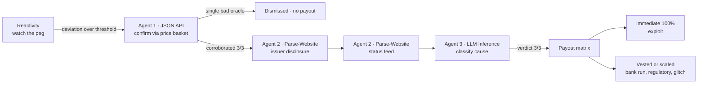

# Sentinel

**Parametric stablecoin-depeg insurance that pays out faster than the rumor cycle, and proves on-chain *why* it paid.**

Sentinel is agent-native insurance built on [Somnia](https://somnia.network), the Agentic L1. When an insured stablecoin loses its peg, Sentinel autonomously confirms the event, investigates the cause with on-chain AI agents, classifies it, and settles valid claims in the same flow. There is no human committee, no governance vote, and no trusted centralized oracle.

The investigation itself is consensus-validated. Independent validators must agree on the AI verdict before a single token moves, and every vote is recorded on-chain for anyone to audit. That verifiability is the entire reason Sentinel can only exist on Somnia.

> Built for the **Somnia Agentathon**.

[](https://github.com/Manuel-dev01/Sentinel/actions/workflows/ci.yml)
&nbsp;
&nbsp;
&nbsp;
&nbsp;

---

## Links

| | |
|---|---|
| **Demo video** | _to be added_ |
| **Live demo** (landing) | [sentinel--page.vercel.app](https://sentinel--page.vercel.app/) — click **Launch desk** to open the dashboard |
| **Live dApp** (desk) | [sentinel-issuer.vercel.app](https://sentinel-issuer.vercel.app) |
| **Mock issuer site** (agent target) | [sentinel-issuer.vercel.app](https://sentinel-issuer.vercel.app) · [`/issuer/incident`](https://sentinel-issuer.vercel.app/issuer/incident) · [`/issuer/social`](https://sentinel-issuer.vercel.app/issuer/social) · [`/api/peg-status`](https://sentinel-issuer.vercel.app/api/peg-status) |
| **Verified Oracle** (Shannon Explorer) | [`0xe6d838c0…a91c`](https://shannon-explorer.somnia.network/address/0xe6d838c0b51e73fAD5F9C06D0fa48FC3C92Aa91c) |
| **Docs** | [Architecture](docs/ARCHITECTURE.md) · [Security](docs/SECURITY.md) · [Verification plan](docs/VERIFICATION.md) |

---

## The problem

On-chain insurance is slow exactly where it matters most. Nexus Mutual settles through member votes that take days. Risk Harbor and InsurAce lean on centralized oracles you have to trust. None of them can react to a stablecoin depeg in the window that counts, which is the first few minutes, when the peg is breaking and nobody yet agrees on *why*.

And the *why* is the whole game. A stablecoin can break its peg from a contract exploit, a bank run, a regulatory action, or a transient technical glitch, and each cause deserves a different response. Detecting the price move is easy. Determining the cause, quickly, in a way nobody has to trust, is the hard part. That is the problem Sentinel solves.

## What Sentinel does



1. A Somnia Reactivity subscription watches a stablecoin's price feed, with no off-chain keeper.
2. On a sustained depeg, the on-chain handler fires and dispatches a JSON-API agent to confirm the move across an independent price basket. A single price source is never enough to pay out.
3. If the move is corroborated, two Parse-Website agents read two independent web sources: the issuer's formal incident disclosure and its status feed. A single spoofed or stale page cannot drive a verdict.
4. An LLM-Inference agent classifies the cause into a fixed taxonomy of `SMART_CONTRACT_EXPLOIT`, `BANK_RUN`, `REGULATORY`, `TECHNICAL_GLITCH`, or `UNKNOWN`, constrained to one token so the validator subcommittee can agree byte-for-byte.
5. A payout matrix routes funds from an LP pool. Exploits pay 100% immediately, while softer causes vest or scale to deter farming. Every validator vote and agent receipt is stored on-chain and rendered in a public audit trail.

The whole chain runs autonomously, from Reactivity to agent to callback to the next agent to payout, with no human between detection and settlement.

## Why only on Somnia

| Capability Sentinel needs | Why other chains cannot | Somnia primitive used |
|---|---|---|
| Detect a depeg with no off-chain keeper | Ethereum and L2s need Gelato or Chainlink Automation polling | **Reactivity**, where validators invoke the handler directly on a matched event |
| Investigate the cause with AI you do not have to trust | An AI call elsewhere is a centralized API, and the studio could lie | **Somnia Agents**, where LLM inference is re-run across a validator subcommittee |
| Pay out in the same flow as the event | L1 finality plus oracle delay is measured in minutes | Sub-second finality, sub-cent fees |
| Prove the verdict | No chain produces a multi-validator-signed AI result | **Consensus-validated agent receipts**, persisted on-chain |

## Design highlights

Each of these is a deliberate engineering decision, and most are a direct response to something learned running on the live platform.

- **Tiered consensus, matched to safety role.** Consensus is not uniform across the pipeline. The two stages that sign the payout, the price Confirm (JSON-API) and the Classify verdict (LLM-Inference, constrained to one token via `allowedValues`), require strict 3-of-3 unanimity, byte-identical. The free-form Parse-Website investigate stages, which only gather corroborating evidence, require a 2-of-3 majority. The reason is empirical: on-chain receipts showed the Parse-Website subcommittee reliably musters only 2 of 3 validators on testnet, where the responders agree perfectly and the third is simply absent. Demanding unanimity there is a pure liveness tax with no safety gain, while the verdict that releases funds still demands full unanimity. The payout signs only on 3-of-3, and the evidence needs a byte-identical majority. (`SentinelOracle._requiredFor` and `_consensusResult`.)
- **Two-source investigation.** The cause is not read from one page. The Oracle scrapes the issuer's formal disclosure and a separate status feed, across two distinct Parse-Website calls, then classifies on the merged evidence.
- **Receipts are on-chain, not reconstructed.** Every validator vote is stored by the Oracle (`getReceipts(eventId)`) and read in a single call. There is no `eth_getLogs` window limit, no off-chain indexer, and no backend. The `/audit` screen is a pure contract read. It is refresh-proof, works for any historical event, and makes each receipt a first-class on-chain artifact.
- **Funding-safe reactive callback.** Detection and every agent dispatch turn all failure modes (underfunding, a platform revert, a missing feed, no consensus, a timeout) into parked, retriable `Failed` states. The contract never reverts inside the Reactivity callback, which would brick the subscription. The operator can call `retry(eventId)` from exactly where the chain stalled.
- **Genuinely autonomous, keeperless monitoring on four real pegs.** A standalone, multi-asset `PriceFeedPoller` runs a self-rescheduling Reactivity cron. Each cycle it dispatches one JSON-API agent per asset to fetch the real USDC, USDT, DAI, and FRAX prices on-chain and write them to dedicated live assets, with no off-chain keeper anywhere. One poller carries a single 32-STT subscription lock for all four assets, where N separate pollers would lock N times 32. This makes "Sentinel detects depegs" literal: the dashboard's LIVE MONITOR shows all four real pegs observed on-chain, and the live assets are real coverage that anyone can buy. A genuine depeg autonomously fires the full pipeline and pays policyholders, and the investigation reads two real independent sources per asset:

  | Live asset | Price (CoinGecko) | Source 1 (formal) | Source 2 (status / data) |
  |---|---|---|---|
  | USDC·live | `usd-coin` | status.circle.com | circle.com/en/usdc |
  | USDT·live | `tether` | tether.to/en/transparency | tether.to/en/news |
  | DAI·live | `dai` | forum.makerdao.com | makerburn.com |
  | FRAX·live | `frax` | gov.frax.finance | facts.frax.finance |

  Separately, four base stablecoins (USDC, USDT, DAI, FRAX) are operator-controlled demo assets. Each is wired to a payout class through the DEMO CAUSE switch, which re-points the issuer pages on-chain, so every matrix cell is demonstrable on demand. The demo assets use a mock price feed so a depeg can be triggered deterministically, and the live assets use the real feed, so the two sets are necessarily distinct.

- **Solvency by construction.** The pool enforces a utilization cap, so it never oversells coverage the capital cannot back. It reserves capital the instant a policy settles, so `paid` stays under or equal to `reserved` both per policy and in aggregate. It also locks LP withdrawals while any insured stable has a live event.

## How this maps to the judging criteria

| Criterion | How Sentinel addresses it |
|---|---|
| **Functionality** | Deployed and source-verified on Somnia testnet. The full detect, confirm, investigate, classify, and payout flow runs end-to-end with no manual steps. Four demo stablecoins and four autonomously-monitored live assets are independently insurable. |
| **Agent-First Design** | Uses all three base agents (JSON API, LLM Parse Website, LLM Inference) in one autonomous chain. The agents decide whether and how much to pay, rather than just automating a transfer. |
| **Innovation and Technical Creativity** | The first parametric insurer whose claim investigation is itself consensus-validated, across two independent web sources, with a tiered consensus rule and on-chain receipts as the proof artifact. |
| **Autonomous Performance** | No human in the loop between detection and settlement. A strict state machine handles every agent response status (success, failure, no consensus, timeout) safely and fails closed. |

## Architecture at a glance

Six contracts plus a Next.js frontend. The contracts turn a price deviation into a justified, consensus-backed payout. The frontend lets policyholders buy coverage, lets LPs provide capital, and lets anyone audit a decision.

| Contract | Responsibility |
|---|---|
| `SentinelRegistry` | Operator-managed registry of insurable stablecoins, holding the peg, thresholds, premium rate, deviation tiers, and issuer URLs. |
| `SentinelPool` | An ERC-4626-style LP vault covering NAV and shares, premium accrual, outstanding-liability tracking, the utilization cap, and the settling-event withdrawal lock. |
| `SentinelPolicy` | ERC-721 coverage covering quote and buy, premium routing, min-age anti-farming, and the claim lifecycle. |
| `SentinelTreasury` | Payout-matrix execution, with immediate payouts for exploits and vested or delayed payouts otherwise, settled per policy to avoid an unbounded loop, and reentrancy-guarded. |
| `SentinelOracle` | The reactive engine and agent orchestrator, holding the event state machine, the three-agent chain, the tiered consensus rule, and the on-chain receipt store. |
| `PriceFeedPoller` | The autonomous, keeperless, multi-asset monitor. A self-rescheduling Reactivity cron fetches each real price through a JSON-API agent and writes it on-chain, so a genuine depeg fires the pipeline with no human. |

The `libraries/` folder holds `Classification` (the cause enum and strict agent-token parser), `PayoutMath` (the payout and timing matrix), and `FixedPoint` (1e18 and bps math). The `mocks/` folder holds `MockPriceOracle` (the operator-controlled price for a deterministic demo) and `MockStable`. The full design, the state-machine diagram, and the decisions log live in [docs/ARCHITECTURE.md](docs/ARCHITECTURE.md).

## Deployed and verified addresses (Somnia testnet, chain 50312)

> Deployed and source-verified on Shannon Explorer, where every contract below carries the green "Verified" tab with Code, Read, and Write. The live Oracle runs tiered validator consensus, the two-source investigation, and eight independently insurable assets (four operator-demo stables and four autonomous live assets). Every validator vote is persisted on-chain through `SentinelOracle.getReceipts` and rendered by `/audit`, with no off-chain indexer.
>
> Re-verify any deploy with `pnpm verify:testnet` (forge to Blockscout). Note that Shannon Explorer's indexer flags a fresh address as a contract a few minutes after deploy, and the Code, Read, and Write tabs (and verification) only become available once it does.

| Contract | Address |
|---|---|
| SentinelRegistry | [`0x4190c7Aee1e3e7FD482C3a019441e0Bb3b601a89`](https://shannon-explorer.somnia.network/address/0x4190c7Aee1e3e7FD482C3a019441e0Bb3b601a89) |
| SentinelPool | [`0x847Bab38C01fA4397E0F1b4F166b9497A7602296`](https://shannon-explorer.somnia.network/address/0x847Bab38C01fA4397E0F1b4F166b9497A7602296) |
| SentinelPolicy | [`0x142c36b77868d8b735501BB2b1cDA8f27837643e`](https://shannon-explorer.somnia.network/address/0x142c36b77868d8b735501BB2b1cDA8f27837643e) |
| SentinelTreasury | [`0x056AA4097aED8887C013Ce953b936c03aEA32FeF`](https://shannon-explorer.somnia.network/address/0x056AA4097aED8887C013Ce953b936c03aEA32FeF) |
| SentinelOracle | [`0xe6d838c0b51e73fAD5F9C06D0fa48FC3C92Aa91c`](https://shannon-explorer.somnia.network/address/0xe6d838c0b51e73fAD5F9C06D0fa48FC3C92Aa91c) |

**Demo stables** (operator-simulated, one per payout class): USDC `0x0195df87…8EEF`, USDT `0x573e0382…44a7`, DAI `0x93C4284A…3435`, FRAX `0x150A14f4…BF33`.

**Live assets** (autonomous, real price plus real two-source investigation, buyable): USDC·live [`0xb12BAA2B…c32F`](https://shannon-explorer.somnia.network/address/0xb12BAA2B5b48ED712aB3C06497E8521ea5E2c32F), USDT·live [`0x4F570269…7E96`](https://shannon-explorer.somnia.network/address/0x4F570269fED5250436d088189bB0c19C86f27E96), DAI·live [`0xbAE3Fa60…B2d3`](https://shannon-explorer.somnia.network/address/0xbAE3Fa6064fe67D218D8ad31F46e977e8dA1B2d3), FRAX·live [`0x832E9407…3a25`](https://shannon-explorer.somnia.network/address/0x832E94079bbED4E4e2017be8328d9f4be8BD3a25). All four are polled by the multi-asset **PriceFeedPoller** [`0xA12a1285…66B5`](https://shannon-explorer.somnia.network/address/0xA12a1285076512B922Fd2B478E0278764a1066B5). The poller is live and funded on-chain; its source verification is pending only because Shannon Explorer's indexer has not yet flagged the address as a contract. Every other contract above is source-verified.

Scaffolding: CAPITAL/sUSD [`0x88f973BA…Cba9`](https://shannon-explorer.somnia.network/address/0x88f973BA7dae69474e609c8bc2CfCd159ae3Cba9), MockPriceOracle [`0xE31b784B…FE7d`](https://shannon-explorer.somnia.network/address/0xE31b784B34f7F986AA2965c33609e15533E0FE7d) (owned by the poller), detection subscription `3711687`.

## Both Somnia primitives, proven on-chain

This is the project's core de-risking. Each primitive was proven on testnet before any business logic depended on it.

| Primitive | What was proven | Tx |
|---|---|---|
| Agents, JSON API (`13174…0097713`) | validator consensus on a live price feed, returning `0.9980` | [`0x8eb8a3ca…66fcb`](https://shannon-explorer.somnia.network/tx/0x8eb8a3ca4b1e42091d0b15df8cb577abfb65fe23235e677c4b538b6fb0c66fcb) |
| Agents, LLM Inference (`12847…1029384`) | Qwen3-30B classified a depeg as `SMART_CONTRACT_EXPLOIT`, with validators byte-identical | [`0x416164a0…566d`](https://shannon-explorer.somnia.network/tx/0x416164a07c4b811b77a76e6421aa0580c01ebbf29ea16c98da331bdf0406566d) |
| Reactivity | a price-feed event invoked the handler on-chain with the correct decoded payload, with no keeper | [`0x1ff5fd04…46396`](https://shannon-explorer.somnia.network/tx/0x1ff5fd0458b0c5f83ee7deb87fe2e2163bed87353fe7af8e8cc73cfa42d46396) |

## Testing

The suite has 126 Foundry tests passing, plus a frontend unit suite. The contract suite includes:

- **Unit and fuzz** across every contract, covering premium and NAV math, payout-matrix cells, and share-to-asset accounting over random deposit and withdraw sequences.
- **Invariant** tests on pool solvency over 128k random operation sequences, asserting `availableCapital + reserved == totalAssets` and `paid <= reserved`.
- **Oracle state machine** (33 tests) driven by a mock three-validator platform, covering every `ResponseStatus` branch, callback idempotency, detection gating, the agent-payload selector lock, the free-the-live-slot-on-failure regression, on-chain receipt persistence, the two-source investigation, and the tiered-consensus rules (3-of-3 required on Confirm and Classify, 2-of-3 accepted on the investigate stages, and a divergent majority still failing).
- **Reentrancy** regression on the payout path.
- **Frontend** tests with `vitest` over the pure formatters and the contract-enum mirrors, which lock the on-chain enum ordering the audit UI depends on.

CI in `.github/workflows/ci.yml` runs `forge fmt`, `build`, and `test`, plus the frontend typecheck, test, and build, on every push.

## Tech stack

- **Contracts:** Solidity 0.8.30, Foundry (unit, fuzz, invariant), Hardhat (deploy and TS interop), OpenZeppelin.
- **Frontend:** Next.js (App Router), TypeScript, Tailwind, wagmi v2 and viem, RainbowKit.
- **Somnia:** the Agents platform, Reactivity, and Shannon Explorer (Blockscout) source verification.
- **Network:** Somnia testnet, on a mainnet-ready architecture.

## Run it yourself

```bash
git clone https://github.com/Manuel-dev01/Sentinel sentinel && cd sentinel
cp .env.example .env            # fill RPC, deployer key, platform + issuer URLs
forge install                  # contract deps
pnpm install                   # scripts + frontend deps

forge build && forge test      # 126 tests

# Deploy frontend/ to Vercel first so the agents have public URLs to read.
# The JSON confirm feed and the two HTML issuer pages must be three different URLs.

pnpm deploy:testnet            # deploy the protocol, wire roles, register stables,
                               # fund + arm the Oracle, seed the pool, buy demo policies
pnpm verify:testnet            # source-verify every contract on Shannon Explorer
node script/gen-frontend.mjs   # resync frontend addresses + ABIs
pnpm simulate:depeg            # push a stable below peg, watch the pipeline settle

cd frontend && pnpm build && pnpm start   # run the dApp (next dev OOMs on low-memory hosts)
```

You will need Somnia testnet tokens from the [faucet](https://testnet.somnia.network/). The Oracle holds at least 32 STT to own its Reactivity subscription, plus a budget for agent-request deposits. The PriceFeedPoller also needs at least 32 STT for its own subscription; if live price polling stops, run `pnpm hardhat run script/fund-poller.ts --network somniaTestnet` to top it up and `pnpm hardhat run script/rearm-poller.ts --network somniaTestnet` to re-arm the cron.

## Repository structure

```
src/            Solidity contracts (Registry, Pool, Policy, Treasury, Oracle, PriceFeedPoller, libraries, mocks)
test/           Foundry unit, fuzz, invariant, and integration tests
script/         deploy.ts, verify.ts, simulate-depeg.ts, gen-frontend.mjs, monitor scripts
frontend/       Next.js app: peg dashboard, coverage, LP, the on-chain audit trail, mock issuer pages
docs/           ARCHITECTURE, SECURITY, VERIFICATION
```

## Scope status

**MVP, fully shipped:** the full autonomous detect, confirm, investigate, classify, and pay flow with all three agents; the exploit to immediate-payout hero path; LP deposit and withdraw; policy buy and claim; the on-chain audit centerpiece; a deterministic demo; testnet deploy with source verification; and complete docs.

**Stretch:**

| Item | Status |
|---|---|
| Full vesting for all causes | Done. `PayoutMath.timing` covers all five causes, and the Treasury executes immediate, vested, and delayed payouts. |
| Multiple deviation tiers | Done. Three-tier payout scaling, configurable per stable. |
| Multiple stablecoins | Done. Four demo stables plus four autonomous live assets, all insurable, with a grouped frontend selector. |
| All payout classes, live | Done. The operator scenario switch re-points the issuer pages so any demo asset can show exploit, bank run, regulatory, or glitch. |
| Autonomous live monitoring | Done. The keeperless `PriceFeedPoller` observes the real USDC, USDT, DAI, and FRAX pegs on-chain, and a genuine depeg auto-fires the pipeline. |
| Two-source investigation | Done. The issuer disclosure and the status feed are read across sequential Parse-Website stages. |
| APY analytics | Done. Estimated LP yield from active coverage on `/lp`. |
| Source verification | Done. All contracts verified on Shannon Explorer through `pnpm verify:testnet`. The poller's verification is pending only because Shannon Explorer's Blockscout indexer has not yet flagged the address as a contract. |
| CI and badges | Done. GitHub Actions with forge and frontend jobs. |
| Cross-chain deposits (LI.FI) | Deferred to a mainnet phase. LI.FI moves real liquid tokens on mainnet chains and cannot settle into a mock testnet capital token. |
| Mainnet deploy | Deferred. Unaudited, and testnet-first by design. |

**To be submission-complete:** record the demo video and publish the live dApp URL. The mock-issuer site is already deployed and wired.

## Roadmap (post-hackathon)

- Risk-priced premiums per stablecoin and a real actuarial model.
- A partner integration to underwrite a Somnia-native stablecoin's own depeg coverage.
- Cross-chain coverage and deposits through LI.FI on mainnet.
- A security audit and a managed upgrade path.

## Status and disclaimer

This is a hackathon prototype. The contracts are unaudited and deployed on testnet for demonstration only, so do not use them with real funds. Somnia Agents and Reactivity are new platforms, and integration details are verified against the live docs at build time and may evolve.

## Author

Built solo by **Emmanuel** for the Somnia Agentathon.

## License

[MIT](LICENSE)
