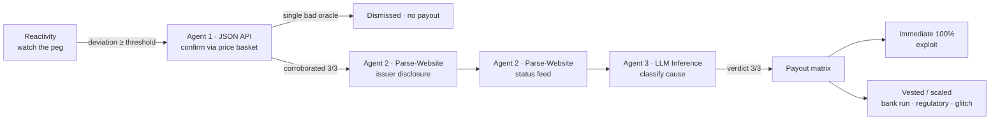

# Sentinel

**Parametric stablecoin-depeg insurance that pays out faster than the rumor cycle — and proves, on-chain, *why* it paid.**

Sentinel is agent-native insurance built on [Somnia](https://somnia.network), the Agentic L1. When an insured stablecoin loses its peg, Sentinel autonomously confirms the event, **investigates the cause with on-chain AI agents**, classifies it, and settles valid claims **in the same flow** — no human committee, no governance vote, no trusted centralized oracle.

The investigation itself is **consensus-validated**: independent validators must agree on the AI verdict before a single token moves, and every vote is recorded on-chain for anyone to audit. That verifiability is the entire reason Sentinel can only exist on Somnia.

> Built for the **Somnia Agentathon**

[](https://github.com/Manuel-dev01/Sentinel/actions/workflows/ci.yml)
&nbsp;
&nbsp;
&nbsp;
&nbsp;

---

## Links

| | |
|---|---|
| 🎬 **Demo video** | _to be added (2–5 min)_ |
| 🖥️ **Live dApp** | _to be added (Vercel)_ |
| 🌐 **Mock issuer site** (agent target) | [sentinel-issuer.vercel.app](https://sentinel-issuer.vercel.app) — [`/issuer/incident`](https://sentinel-issuer.vercel.app/issuer/incident) · [`/issuer/social`](https://sentinel-issuer.vercel.app/issuer/social) · [`/api/peg-status`](https://sentinel-issuer.vercel.app/api/peg-status) |
| 🔍 **Verified Oracle** (Shannon Explorer) | [`0xe6d838c0…a91c`](https://shannon-explorer.somnia.network/address/0xe6d838c0b51e73fAD5F9C06D0fa48FC3C92Aa91c) |
| 📖 **Docs** | [Architecture](docs/ARCHITECTURE.md) · [Demo runbook](docs/DEMO.md) · [Security](docs/SECURITY.md) |

---

## The problem

On-chain insurance is slow exactly where it matters most. Nexus Mutual settles via member votes that take days. Risk Harbor and InsurAce lean on centralized oracles you have to trust. None of them can react to a stablecoin depeg in the window that counts — the first minutes, when the peg is breaking and nobody yet agrees on *why*.

And the *why* is the whole game. A stablecoin can break its peg from a **contract exploit**, a **bank run**, a **regulatory action**, or a **transient technical glitch** — and each deserves a different response. Detecting the price move is easy; determining the **cause**, fast, in a way nobody has to trust, is the hard part. That is the problem Sentinel solves.

## What Sentinel does



1. A **Somnia Reactivity** subscription watches a stablecoin's price feed — with **no off-chain keeper**.
2. On a sustained depeg, the on-chain handler fires and dispatches a **JSON-API agent** to confirm the move across an independent price basket. *A single price source is never enough to pay out.*
3. If corroborated, two **Parse-Website agents** read two independent web sources — the issuer's formal incident disclosure **and** its status feed — so a single spoofed or stale page can't drive a verdict.
4. An **LLM-Inference agent** classifies the cause into a fixed taxonomy — `SMART_CONTRACT_EXPLOIT`, `BANK_RUN`, `REGULATORY`, `TECHNICAL_GLITCH`, or `UNKNOWN` — constrained to one token so the validator subcommittee can agree byte-for-byte.
5. A payout matrix routes funds from an LP pool: exploits pay **100% immediately**; softer causes **vest or scale** to deter farming. Every validator vote and agent receipt is stored on-chain and rendered in a public audit trail.

The whole chain runs autonomously — Reactivity → Agent → callback → next Agent → … → payout — with no human between detection and settlement.

## Why only on Somnia

| Capability Sentinel needs | Why other chains can't | Somnia primitive used |
|---|---|---|
| Detect a depeg with no off-chain keeper | Ethereum/L2s need Gelato/Chainlink Automation polling | **Reactivity** — validators invoke the handler directly on a matched event |
| Investigate the cause with AI you don't have to trust | An AI call elsewhere is a centralized API — the studio could lie | **Somnia Agents** — LLM inference re-run by a validator subcommittee |
| Pay out in the same flow as the event | L1 finality + oracle delay measured in minutes | Sub-second finality, sub-cent fees |
| Prove the verdict | No chain produces a multi-validator-signed AI result | **Consensus-validated agent receipts**, persisted on-chain |

## Design highlights

Each of these is a deliberate engineering decision — most of them a response to something learned running on the live platform.

- **Tiered consensus, matched to safety role.** Consensus is *not* uniform across the pipeline. The two stages that **sign the payout** — the price **Confirm** (JSON-API) and the **Classify** verdict (LLM-Inference, constrained to one token via `allowedValues`) — require strict **3-of-3 unanimity, byte-identical**. The free-form **Parse-Website** investigate stages, which only *gather corroborating evidence*, require a **2-of-3 majority**. Why: on-chain receipts showed the Parse-Website subcommittee reliably musters only 2 of 3 validators on testnet (the responders agree perfectly; the third is simply absent), so demanding unanimity there is a pure liveness tax with no safety gain — while the verdict that releases funds still demands full unanimity. ***The payout signs only on 3-of-3; the evidence needs a byte-identical majority.*** (`SentinelOracle._requiredFor` / `_consensusResult`.)
- **Two-source investigation.** The cause isn't read from one page. The Oracle scrapes the issuer's formal disclosure *and* a separate status feed — two distinct Parse-Website calls across sequential stages — then classifies on the merged evidence.
- **Receipts are on-chain, not reconstructed.** Every validator vote is stored by the Oracle (`getReceipts(eventId)`) and read in a single call — no `eth_getLogs` window limit, no off-chain indexer, no backend. The `/audit` screen is a pure contract read: refresh-proof, works for any historical event, and makes each receipt a first-class on-chain artifact.
- **Funding-safe reactive callback.** Detection and every agent dispatch turn all failure modes (underfunding, a platform revert, a missing feed, no-consensus, timeout) into parked, **retriable `Failed` states** — never a revert inside the Reactivity callback, which would brick the subscription. The operator can `retry(eventId)` from exactly where the chain stalled.
- **Genuinely autonomous monitoring (keeperless), on four real pegs.** A standalone **multi-asset** `PriceFeedPoller` runs a **self-rescheduling Reactivity cron** that, each cycle, dispatches a JSON-API agent per asset to fetch the **real** USDC/USDT/DAI/FRAX prices on-chain and write them to dedicated `…·live` assets — no off-chain keeper anywhere. One poller = **one 32-STT subscription lock for all four** (N separate pollers would lock N×32). This makes *"Sentinel detects depegs"* literal: the dashboard's **LIVE MONITOR** shows all four real pegs observed on-chain, and **the `…·live` assets are real coverage anyone can buy** — a genuine depeg autonomously fires the full pipeline and pays policyholders, with the investigation reading **two real independent sources** per asset:

  | Live asset | Price (CoinGecko) | Source 1 (formal) | Source 2 (status/data) |
  |---|---|---|---|
  | USDC·live | `usd-coin` | status.circle.com | circle.com/en/usdc |
  | USDT·live | `tether` | tether.to/en/transparency | tether.to/en/news |
  | DAI·live | `dai` | forum.makerdao.com | makerburn.com |
  | FRAX·live | `frax` | gov.frax.finance | facts.frax.finance |

  Separately, the four base stables (USDC/USDT/DAI/FRAX) are **operator-controlled demo assets**, each wired to a payout class via the **DEMO CAUSE** switch (which re-points the issuer pages on-chain) so every matrix cell is demoable on demand. (Demo assets use a *mock* price feed so a depeg can be triggered deterministically; live assets use the *real* feed — they're necessarily distinct.)
- **Solvency by construction.** The pool enforces a utilization cap (no overselling coverage the capital can't back), reserves capital the instant a policy settles (`paid ≤ reserved`, per policy and in aggregate), and **locks LP withdrawals while any insured stable has a live event**.

## How this maps to the judging criteria

| Criterion | How Sentinel addresses it |
|---|---|
| **Functionality** | Deployed and source-verified on Somnia testnet; the full detect→confirm→investigate→classify→payout flow runs end-to-end with no manual steps. Two stablecoins (USDC + USDT) are independently insurable. |
| **Agent-First Design** | Uses all three base agents (JSON API, LLM Parse Website, LLM Inference) in one autonomous chain; the agents *decide whether and how much to pay*, not just automate a transfer. |
| **Innovation & Technical Creativity** | First parametric insurer whose **claim investigation is itself consensus-validated**, across **two independent web sources**, with a **tiered** consensus rule and on-chain receipts as the proof artifact. |
| **Autonomous Performance** | No human in the loop between detection and settlement; a strict state machine handles every agent response status (success, failure, no-consensus, timeout) safely and fails closed. |

## Architecture at a glance

Five contracts plus a Next.js frontend. The contracts turn a price deviation into a justified, consensus-backed payout; the frontend lets policyholders buy coverage, LPs provide capital, and anyone audit a decision.

| Contract | Responsibility |
|---|---|
| `SentinelRegistry` | Operator-managed registry of insurable stablecoins (peg, thresholds, premium rate, deviation tiers, issuer URLs). |
| `SentinelPool` | ERC-4626-style LP vault — NAV/shares, premium accrual, outstanding-liability tracking, utilization cap, settling-event withdrawal lock. |
| `SentinelPolicy` | ERC-721 coverage — quote/buy, premium routing, min-age anti-farming, claim lifecycle. |
| `SentinelTreasury` | Payout-matrix execution — immediate (exploit) vs. vested/delayed; per-policy `settle` (no unbounded loop); reentrancy-guarded. |
| `SentinelOracle` | The reactive engine + agent orchestrator — the event state machine, the 3-agent chain, tiered consensus, and the on-chain receipt store. |
| `PriceFeedPoller` | Autonomous keeperless monitor — a self-rescheduling Reactivity cron fetches the real price via a JSON-API agent and writes it on-chain, so a genuine depeg fires the pipeline with no human. |

`libraries/`: `Classification` (cause enum + strict agent-token parse), `PayoutMath` (the payout/timing matrix), `FixedPoint` (1e18/bps math). `mocks/`: `MockPriceOracle` (operator-controlled price for a deterministic demo) and `MockStable`. Full design, the state-machine diagram, and the decisions log are in [docs/ARCHITECTURE.md](docs/ARCHITECTURE.md).

## Deployed & verified addresses (Somnia testnet, chain 50312)

> Deployed and **source-verified** on Shannon Explorer — every contract carries the green “Verified” tab (Code / Read / Write). The live Oracle runs **tiered validator consensus**, the **two-source investigation**, and **two independently insurable stablecoins** (USDC + USDT). Every validator vote is persisted on-chain (`SentinelOracle.getReceipts`) and rendered by `/audit` — no off-chain indexer.
>
> Re-verify any deploy with `pnpm verify:testnet` (forge → Blockscout). Note: Shannon Explorer's indexer flags a fresh address as a contract a few minutes after deploy; the Code/Read/Write tabs (and verification) only become available once it does.

| Contract | Address |
|---|---|
| SentinelRegistry | [`0x4190c7Aee1e3e7FD482C3a019441e0Bb3b601a89`](https://shannon-explorer.somnia.network/address/0x4190c7Aee1e3e7FD482C3a019441e0Bb3b601a89) |
| SentinelPool | [`0x847Bab38C01fA4397E0F1b4F166b9497A7602296`](https://shannon-explorer.somnia.network/address/0x847Bab38C01fA4397E0F1b4F166b9497A7602296) |
| SentinelPolicy | [`0x142c36b77868d8b735501BB2b1cDA8f27837643e`](https://shannon-explorer.somnia.network/address/0x142c36b77868d8b735501BB2b1cDA8f27837643e) |
| SentinelTreasury | [`0x056AA4097aED8887C013Ce953b936c03aEA32FeF`](https://shannon-explorer.somnia.network/address/0x056AA4097aED8887C013Ce953b936c03aEA32FeF) |
| SentinelOracle | [`0xe6d838c0b51e73fAD5F9C06D0fa48FC3C92Aa91c`](https://shannon-explorer.somnia.network/address/0xe6d838c0b51e73fAD5F9C06D0fa48FC3C92Aa91c) |

**Demo stables** (operator-simulated, four payout classes): USDC `0x0195df87…8EEF` · USDT `0x573e0382…44a7` · DAI `0x93C4284A…3435` · FRAX `0x150A14f4…BF33`.

**Live assets** (autonomous, real price + real two-source investigation, buyable): USDC·live [`0xb12BAA2B…c32F`](https://shannon-explorer.somnia.network/address/0xb12BAA2B5b48ED712aB3C06497E8521ea5E2c32F) · USDT·live [`0x4F570269…7E96`](https://shannon-explorer.somnia.network/address/0x4F570269fED5250436d088189bB0c19C86f27E96) · DAI·live [`0xbAE3Fa60…B2d3`](https://shannon-explorer.somnia.network/address/0xbAE3Fa6064fe67D218D8ad31F46e977e8dA1B2d3) · FRAX·live [`0x832E9407…3a25`](https://shannon-explorer.somnia.network/address/0x832E94079bbED4E4e2017be8328d9f4be8BD3a25), all polled by the multi-asset **PriceFeedPoller** [`0xA12a1285…66B5`](https://shannon-explorer.somnia.network/address/0xA12a1285076512B922Fd2B478E0278764a1066B5).

Scaffolding: CAPITAL/sUSD [`0x88f973BA…Cba9`](https://shannon-explorer.somnia.network/address/0x88f973BA7dae69474e609c8bc2CfCd159ae3Cba9) · MockPriceOracle [`0xE31b784B…FE7d`](https://shannon-explorer.somnia.network/address/0xE31b784B34f7F986AA2965c33609e15533E0FE7d) (owned by the poller) · detection sub `3711687`.

## Both Somnia primitives, proven on-chain

The project's core de-risking — each primitive was proven on testnet *before* any business logic depended on it:

| Primitive | What was proven | Tx |
|---|---|---|
| Agents · JSON API (`13174…0097713`) | validator consensus on a live price feed → `0.9980` | [`0x8eb8a3ca…66fcb`](https://shannon-explorer.somnia.network/tx/0x8eb8a3ca4b1e42091d0b15df8cb577abfb65fe23235e677c4b538b6fb0c66fcb) |
| Agents · LLM Inference (`12847…1029384`) | Qwen3-30B classified a depeg as `SMART_CONTRACT_EXPLOIT`, **validators byte-identical** | [`0x416164a0…566d`](https://shannon-explorer.somnia.network/tx/0x416164a07c4b811b77a76e6421aa0580c01ebbf29ea16c98da331bdf0406566d) |
| Reactivity | a price-feed event invoked the handler on-chain with the correct decoded payload, **no keeper** | [`0x1ff5fd04…46396`](https://shannon-explorer.somnia.network/tx/0x1ff5fd0458b0c5f83ee7deb87fe2e2163bed87353fe7af8e8cc73cfa42d46396) |

## Testing

**126 Foundry tests passing**, plus a frontend unit suite. The contract suite includes:

- **Unit + fuzz** across every contract — premium/NAV math, payout-matrix cells, share/asset accounting over random deposit/withdraw sequences.
- **Invariant** — pool solvency over 128k random operation sequences (`availableCapital + reserved == totalAssets`; `paid ≤ reserved`).
- **Oracle state machine (33 tests)** driven by a mock 3-validator platform — every `ResponseStatus` branch, callback idempotency, detection gating, the agent-payload selector lock, the free-the-live-slot-on-failure regression, on-chain-receipt persistence, the two-source investigation, and the **tiered-consensus rules** (3/3 required on Confirm/Classify; 2-of-3 accepted on the investigate stages; a divergent majority still fails).
- **Reentrancy** regression on the payout path.
- **Frontend** — `vitest` over the pure formatters and the contract-enum mirrors (locks the on-chain enum ordering the audit UI depends on).

CI (`.github/workflows/ci.yml`) runs `forge fmt`/`build`/`test` and the frontend typecheck/test/build on every push.

## Tech stack

- **Contracts:** Solidity 0.8.30 · Foundry (unit/fuzz/invariant) · Hardhat (deploy + TS interop) · OpenZeppelin
- **Frontend:** Next.js (App Router) · TypeScript · Tailwind · wagmi v2 / viem · RainbowKit
- **Somnia:** Agents platform · Reactivity · Shannon Explorer (Blockscout) source verification
- **Network:** Somnia testnet — mainnet-ready architecture

## Run it yourself

```bash
git clone https://github.com/Manuel-dev01/Sentinel sentinel && cd sentinel
cp .env.example .env            # fill RPC, deployer key, platform + issuer URLs
forge install                  # contract deps
pnpm install                   # scripts + frontend deps

forge build && forge test      # 126 tests

# Deploy frontend/ to Vercel first so the agents have public URLs to read
# (see docs/DEMO.md §1a — the JSON confirm feed and the two HTML issuer pages
#  must be three different URLs).

pnpm deploy:testnet            # deploy 9 contracts, wire roles, register USDC+USDT,
                               # fund + arm the Oracle, seed the pool, buy demo policies
pnpm verify:testnet            # source-verify every contract on Shannon Explorer
node script/gen-frontend.mjs   # resync frontend addresses + ABIs
pnpm simulate:depeg            # push USDC below peg, watch the pipeline settle

cd frontend && pnpm build && pnpm start   # run the dApp (next dev OOMs on low-mem hosts)
```

You'll need Somnia testnet tokens (from the [faucet](https://testnet.somnia.network/)) — the Oracle holds ≥32 STT to own its Reactivity subscription plus a budget for agent-request deposits.

## Repository structure

```
src/            Solidity contracts (Registry · Pool · Policy · Treasury · Oracle · libraries · mocks)
test/           Foundry unit / fuzz / invariant / integration tests
script/         deploy.ts · verify.ts · simulate-depeg.ts · gen-frontend.mjs · spikes
frontend/       Next.js app — peg dashboard, coverage, LP, the on-chain audit trail, mock issuer pages
docs/           ARCHITECTURE · DEMO · SECURITY
CLAUDE.md       Engineering manual (project source of truth)
```

## Scope status

**MVP — fully shipped:** the full autonomous detect→confirm→investigate→classify→pay flow with all three agents · the exploit→immediate-payout hero path · LP deposit/withdraw · policy buy/claim · the on-chain audit centerpiece · a deterministic demo · testnet deploy + source verification · complete docs.

**Stretch:**

| Item | Status |
|---|---|
| Full vesting for all causes | ✅ `PayoutMath.timing` covers all 5 causes; Treasury executes immediate/vested/delayed |
| Multiple deviation tiers | ✅ 3-tier payout scaling, configurable per stable |
| **Multiple stablecoins** | ✅ USDC + USDT + DAI + FRAX, all insurable; frontend stable-selector |
| **All payout classes, live** | ✅ operator **scenario switch** re-points the issuer pages so any asset can demo exploit / bank-run / regulatory / glitch |
| **Autonomous live monitoring** | ✅ keeperless `PriceFeedPoller` (Reactivity cron + JSON-API agent) observes the real USDC peg on-chain; a genuine depeg auto-fires the pipeline |
| **Two-source investigation** | ✅ issuer disclosure + status feed (sequential Parse-Website stages) |
| APY analytics | ✅ estimated LP yield from active coverage on `/lp` |
| Source verification | ✅ all contracts verified on Shannon Explorer (`pnpm verify:testnet`) |
| CI + badges | ✅ GitHub Actions; forge + frontend jobs |
| Cross-chain deposits (LI.FI) | ⏸️ Deferred to a mainnet phase — LI.FI moves real liquid tokens on mainnet chains; it can't settle into a mock testnet capital token |
| Mainnet deploy | ❌ Deferred — unaudited; testnet-first by design |

**To be submission-complete:** record the demo video; publish the live dApp URL (the mock-issuer site is already deployed and wired).

## Roadmap (post-hackathon)

- Risk-priced premiums per stablecoin and a real actuarial model
- Partner integration: underwrite a Somnia-native stablecoin's own depeg coverage
- A third investigation source (issuer GitHub activity — `repoUrl` is already stored)
- Cross-chain coverage and deposits via LI.FI on mainnet
- Security audit and a managed upgrade path

## Status & disclaimer

This is a hackathon prototype. The contracts are **unaudited** and deployed on testnet for demonstration only — do not use with real funds. Somnia Agents and Reactivity are new platforms; integration details are verified against the live docs at build time and may evolve.

## Author

Built solo by **Emmanuel** for the Somnia Agentathon.

## License

[MIT](LICENSE)
