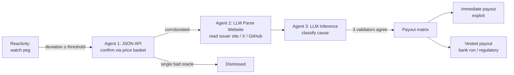

# Sentinel

**Insurance that pays out faster than the rumor cycle — and proves *why* it paid.**

Sentinel is agent-native parametric insurance for stablecoin depegs, built on [Somnia](https://somnia.network), the Agentic L1. When an insured stablecoin loses its peg, Sentinel autonomously confirms the event, **investigates the cause using on-chain AI agents**, classifies it, and pays valid claims **within the same block** — with no human committee, no governance vote, and no trusted centralized oracle.

The investigation itself is consensus-validated: multiple independent validators must agree on the AI verdict before a single token moves. That verifiability is the entire reason Sentinel can only exist on Somnia.

> Built for the **Somnia Agentathon** (Encode Club, 2026).

---

## The problem

On-chain insurance today is slow where it matters most. Nexus Mutual settles via member votes that take days or weeks. Risk Harbor and InsurAce lean on centralized oracles you have to trust. None of them can react to a stablecoin depeg in the window that actually matters — the first minutes, when the peg is breaking and nobody yet agrees on *why*.

A stablecoin can lose its peg from a contract exploit, a bank run, a regulatory action, or a transient technical glitch — and each cause deserves a different response. The hard part isn't detecting the price move; it's determining the **cause**, fast, in a way nobody has to trust.

## What Sentinel does



1. A **Somnia Reactivity** subscription watches a stablecoin's price feed — no off-chain keeper.
2. On a sustained depeg, an on-chain handler fires and dispatches a **Somnia Agent (JSON API)** to confirm the move across an independent price basket. A single bad oracle is never enough to pay out.
3. If corroborated, a **Somnia Agent (LLM Parse Website)** reads the issuer's homepage, social, and recent GitHub activity.
4. A **Somnia Agent (LLM Inference)** classifies the cause — `SMART_CONTRACT_EXPLOIT`, `BANK_RUN`, `REGULATORY`, `TECHNICAL_GLITCH`, or `UNKNOWN` — and a validator subcommittee must reach consensus on the answer.
5. A payout matrix routes funds from an LP pool: exploits pay 100% immediately; softer causes vest to deter farming. Every validator vote and agent receipt is recorded on-chain and rendered in a public audit trail.

## Why only on Somnia

| Capability Sentinel needs | Why other chains can't | Somnia primitive used |
|---|---|---|
| Detect a depeg with no off-chain keeper | Ethereum/L2s need Gelato/Chainlink Automation polling | **Reactivity** (validators invoke the handler directly) |
| Investigate cause with AI you don't have to trust | AI calls elsewhere are a centralized API — the studio could lie | **Somnia Agents** (LLM inference re-run by a validator subcommittee) |
| Pay out in the same block as the event | L1 finality + oracle delay measured in minutes | Sub-second finality, sub-cent fees |
| Prove the verdict | No chain produces a multi-validator-signed AI result | **Consensus-validated agent receipts** |

## How this maps to the judging criteria

| Criterion | How Sentinel addresses it |
|---|---|
| **Functionality** | Deployed on Somnia testnet; full detect→confirm→investigate→classify→payout flow runs end-to-end without manual steps. |
| **Agent-First Design** | Uses all three base agents (JSON API, LLM Parse Website, LLM Inference) in a single autonomous chain; agents *decide whether and how much* to pay, not just automate a transfer. |
| **Innovation & Technical Creativity** | First parametric insurer whose **claim investigation is consensus-validated**; chains Reactivity → Agents → payout; the audit receipt is a first-class on-chain artifact. |
| **Autonomous Performance** | No human in the loop between detection and settlement; the system maintains a strict state machine and handles every agent response status (success, failure, no-consensus, timeout) safely. |

## Tech stack

- **Contracts:** Solidity · Foundry (tests/fuzz/invariants) · Hardhat (deploy/TS interop) · OpenZeppelin
- **Frontend:** Next.js (App Router) · TypeScript · Tailwind · ethers v6 · wagmi/viem
- **Somnia:** Agents platform · Reactivity · [LI.FI](https://li.fi) for cross-chain deposits
- **Network:** Somnia testnet (mainnet-ready architecture)

## Quickstart

```bash
git clone <repo-url> sentinel && cd sentinel
cp .env.example .env          # fill in RPC, deployer key, platform addresses
forge install                  # contract deps
npm install                    # frontend + scripts deps

forge build && forge test      # run the contract test suite

# Deploy to Somnia testnet (see docs/ARCHITECTURE.md for the full runbook)
npx hardhat run script/Deploy.s.sol --network somniaTestnet

# Run the demo trigger
npx ts-node script/simulate-depeg.ts

# Frontend
cd frontend && npm run dev
```

You'll need Somnia testnet tokens (from the Somnia Discord `#dev-chat` faucet) for deployment and agent-request deposits.

## Deployed addresses (Somnia testnet)

> _To be filled after deployment._

| Contract | Address |
|---|---|
| SentinelRegistry | `0x…` |
| SentinelPool | `0x…` |
| SentinelPolicy | `0x…` |
| SentinelTreasury | `0x…` |
| SentinelOracle | `0x…` |

## Demo

> _Demo video link to be added (2–5 min)._ See [docs/DEMO.md](docs/DEMO.md) for the runbook and how to reproduce it locally.

The demo is deterministic by design: a mock price oracle (under operator control) and a mock issuer page let the full depeg → investigation → payout flow be triggered live and repeatably.

## Repository structure

```
src/            Solidity contracts (Registry, Pool, Policy, Treasury, Oracle, libraries, mocks)
test/           Foundry unit / fuzz / invariant / integration tests
script/         Deploy + demo scripts (simulate-depeg)
frontend/       Next.js app (peg dashboard, policies, LP, audit trail)
docs/           ARCHITECTURE · DEMO · SECURITY
CLAUDE.md       Engineering manual (project source of truth)
```

## Documentation

- [**Architecture**](docs/ARCHITECTURE.md) — system design, the event state machine, agent orchestration, contract responsibilities, design-decision log.
- [**Demo runbook**](docs/DEMO.md) — the minute-by-minute demo script, deterministic setup, and live-failure fallback.
- [**Security**](docs/SECURITY.md) — threat model, trust assumptions, attack vectors and mitigations, prototype limitations.

## Roadmap (post-hackathon)

- Multiple insured stablecoins with risk-priced premiums
- Partner integration: underwrite a Somnia-native stablecoin's own depeg coverage
- Real actuarial pricing model and capital-efficiency improvements
- Security audit and upgrade path
- Cross-chain coverage via LI.FI for stablecoins on any connected chain

## Status & disclaimer

This is a hackathon prototype. The contracts are **unaudited** and deployed on testnet for demonstration. Do not use with real funds. Somnia Agents and Reactivity are new platforms; integration details are verified against the live docs at build time and may evolve.

## Author

Built solo by Emmanuel for the Somnia Agentathon.

## License

[MIT](LICENSE)
