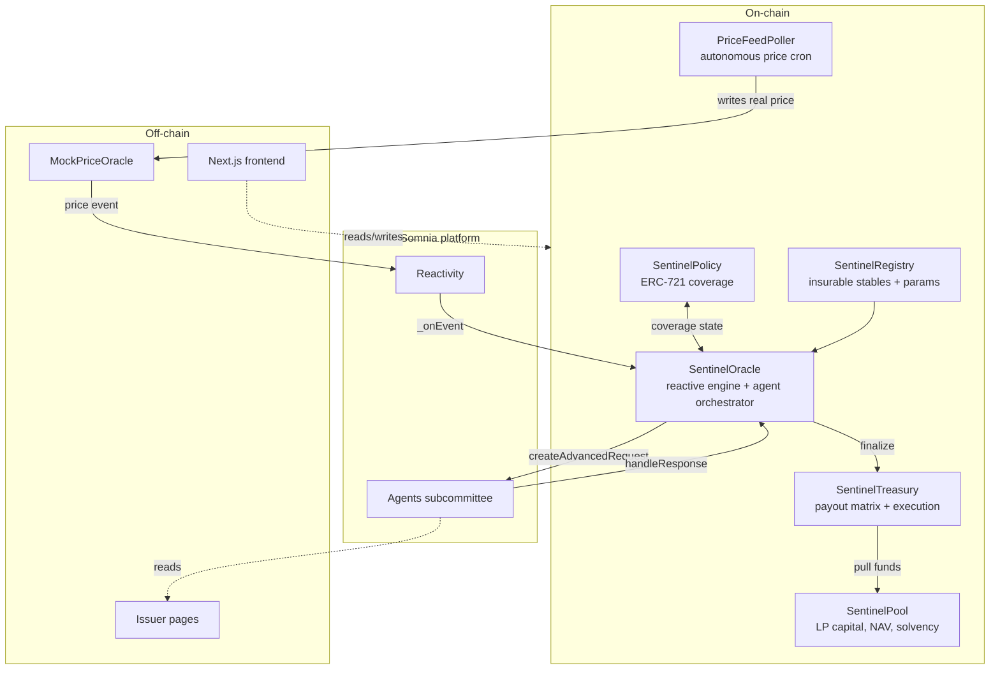
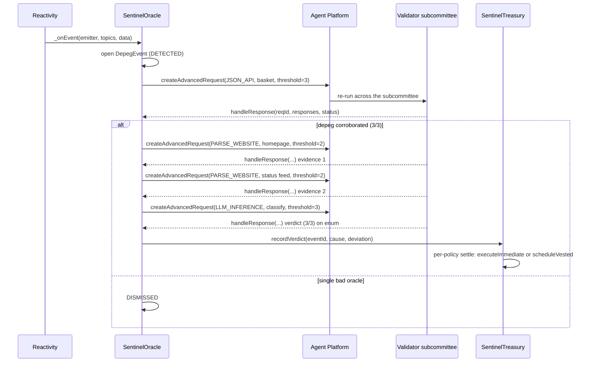

# Architecture

This document describes how Sentinel is designed and why. Where this document and the live Somnia docs disagree on platform specifics, the live docs are authoritative.

---

## 1. System overview

Sentinel is a set of Solidity contracts plus a Next.js frontend. The contracts implement an autonomous pipeline that turns a price deviation into a justified, consensus-backed insurance payout. The frontend lets policyholders buy coverage, lets LPs provide capital, and lets anyone audit a payout decision.



The only off-chain components are the mock price oracle (so a demo depeg can be triggered deterministically), the issuer pages (the targets the investigation agents read), and the frontend. There is no off-chain backend in the trust path. The `PriceFeedPoller` shown above closes the loop autonomously: it fetches real prices through an agent and writes them on-chain, so detection runs on real data with no keeper.

## 2. The event state machine

Each detected depeg is a first-class on-chain object that advances through a strict state machine. State only advances on a valid, consensus-reached agent response bound to the correct request and stage.


The two `INVESTIGATING` sub-steps are the two-source investigation. The event stays in `INVESTIGATING` across both Parse-Website calls, first the issuer's formal disclosure and then its status feed, and only advances to `CLASSIFYING` once both disclosures are gathered and merged. A single-source stable with no distinct `socialUrl` skips straight from the first source to `CLASSIFYING`.

Key properties:

- **Idempotent callbacks.** A late or duplicate agent response must not re-advance state or double-pay. Each `requestId` maps to exactly one event and stage, and the context entry is deleted on first handling, so a replay, late, or duplicate callback is a no-op.
- **Fail-safe defaults.** A `ResponseStatus` of failure, no consensus, or timeout does not pay out. It parks the event as `FAILED`, which frees the stable's live slot, and the operator can call `retry(eventId)` to resume from exactly where it stalled. A stuck event is always preferable to an unjustified payout.
- **No human step** exists between `DETECTED` and `SETTLED` on the happy path.

## 3. Agent orchestration

The agent calls run in sequence, each gated on the previous result. The orchestration lives in `SentinelOracle`.



The per-stage `threshold` is the tiered consensus rule (see Section 7). It is 3 for the payout-gating Confirm and Classify, and 2 for the two Parse-Website investigate stages. The Oracle re-checks agreement on-chain in `_consensusResult(responses, required)`, so it never trusts the platform's report or `responses[0]`.

**Determinism requirement.** For the LLM-Inference call to reach subcommittee consensus, every validator must produce the same output. The classifier calls `inferString(prompt, system, chainOfThought, allowedValues)` with `allowedValues` set to the fixed Classification token set and `chainOfThought` set to false, which constrains the model to one token and lets the subcommittee agree byte-for-byte. The fallback, if a future model regresses, is to extract structured evidence and classify on-chain.

**Agent payload encoding.** The `payload` argument to a request is treated as calldata: a 4-byte agent-method selector followed by ABI-encoded arguments. Build it with `abi.encodeWithSelector(IAgent.method.selector, ...)`, never a bare `abi.encode(...)`, which the agent rejects as an unknown function selector. JSON-API selectors are bare dot-paths such as `"price"`, with no `$.` prefix. The canonical interfaces live in `src/interfaces/IAgentPlatform.sol`.

**Deposit budgeting.** Agent requests are funded above `getRequestDeposit() + pricePerAgent * subcommitteeSize`. Under-funding sets the per-agent budget near zero and validators silently ignore the request. The Oracle holds a native-token balance for this and implements `receive()` to capture the median-cost rebate. Measured costs are roughly 0.03 STT per validator for JSON API, 0.07 STT for LLM Inference, and 0.10 STT for Parse-Website. The per-stage requirement is passed as the `createAdvancedRequest` threshold so the platform finalizes at the right count.

## 4. Contract responsibilities

| Contract | Responsibility | Key invariant |
|---|---|---|
| **SentinelRegistry** | Operator-managed list of insurable stablecoins and their parameters (peg target, threshold bps, min duration, premium rate, deviation tiers, issuer URLs) | Only registered and active stables can be insured or trigger events |
| **SentinelPool** | LP capital as ERC-4626-style shares, NAV, premium accrual, the solvency utilization cap, and authorized payout pulls | Shares never mint value from nothing, capital reserved for a settling event cannot be withdrawn, and `liability <= capital * cap` |
| **SentinelPolicy** | ERC-721 coverage and the policy lifecycle (quote, buy, active, claimable, claimed, expired) | Claimable only if the policy was active and past min-age at event-trigger time and the stable matches |
| **SentinelOracle** | The reactive handler, agent orchestrator, and event state machine | State advances only on valid consensus-reached responses, callbacks are idempotent, and there is no payout without a finalized classification |
| **SentinelTreasury** | Payout-matrix application and immediate or vested execution | Total paid per event stays under or equal to reserved, with CEI plus a reentrancy guard, and vested claims cannot over-claim |
| **PriceFeedPoller** | The autonomous, multi-asset price monitor: a self-rescheduling Reactivity cron that fetches real prices through a JSON-API agent and writes them on-chain | Funding-safe (never reverts the cron callback), writes only its configured live assets, owns the price oracle so operator writes route through it |
| **SimGateway** | Owns the poller and re-exposes its price write to any wallet, but only for allow-listed demo stables, so a judge can trigger a simulated depeg self-serve | Live assets are never simulatable (reverts `NotSimulatable`), the poller keeps owning the price oracle so the monitor is untouched, and operator-only poller admin is forwarded to the operator |

Shared logic lives in `libraries/`: `PayoutMath` (the factor from classification, deviation, and tier), `Classification` (the cause enum and strict parsing of agent output), and `FixedPoint` (one money convention).

## 5. Data model (core structs)

These shapes are indicative.

```solidity
struct StableConfig {
    uint256 pegTarget;          // fixed-point, e.g. 1e18 for $1.00
    uint16  depegThresholdBps;  // deviation that arms detection
    uint32  minDurationSeconds; // sustained-deviation requirement
    uint16  annualRateBps;      // premium pricing
    DeviationTiers tiers;       // tier boundaries for payout scaling
    string  homepageUrl;        // Parse-Website source 1
    string  socialUrl;          // Parse-Website source 2
    string  repoUrl;            // reserved; intentionally unused (a repo adds no depeg signal)
    bool    active;
}

struct DepegEvent {
    address stable;
    uint256 detectedPrice;
    uint256 confirmedPrice;
    uint256 deviationBps;
    uint64  triggeredAt;
    EventState state;
    Stage stage;
    Classification.Cause cause; // set at CLASSIFIED
    string  disclosure;         // investigation source 1
    string  disclosure2;        // investigation source 2
}

struct Receipt {              // one per validator per stage, read by the audit UI
    Stage stage;
    uint256 requestId;
    uint256 agentId;
    address validator;
    ResponseStatus status;
    bytes   result;
    uint256 executionCost;
    uint64  timestamp;
}
```

## 6. Why Somnia (technical rationale)

- **Reactivity** removes the off-chain keeper. On other chains, detecting a depeg and acting on it means a bot polling an RPC and racing to land a transaction, which is the exact failure mode that breaks automated DeFi at the worst moment. Somnia validators invoke the handler directly when the subscribed condition matches.
- **Agents** make the investigation trustless. An AI call from a normal contract is an oracle to a centralized model, so you trust whoever runs it. Somnia re-runs the model across a validator subcommittee and gates the result on consensus, so the reason for a payout inherits the chain's trust guarantees.
- **Performance** makes same-flow settlement real. Sub-second finality and sub-cent fees mean the immediate-tier payout can land before the depeg news finishes spreading, and the many small agent and payout transactions stay economical.

## 7. Design decisions

- **Tiered consensus, matched to safety role.** Consensus is not uniform across the pipeline. The two payout-gating stages, the JSON-API price Confirm and the LLM-Inference Classify verdict, require strict 3-of-3 unanimity. The two free-form Parse-Website investigate stages require a 2-of-3 majority. The first design used strict 3/3 everywhere, but live testing showed that the Parse-Website subcommittee reliably musters only 2 of 3 validators on testnet, where the two that respond agree byte-for-byte and the third is simply absent within the timeout. Demanding unanimity there fails about half the time on a quorum that agrees, which is a pure liveness tax with no safety benefit, while the verdict that releases funds still demands full unanimity. `SentinelOracle._requiredFor(stage)` returns the required count, which is passed as the `createAdvancedRequest` threshold and re-checked in `_consensusResult(responses, required)`. That function returns the largest byte-identical Success group only if its size meets the required count, so a 1-1-1 split or any sub-threshold agreement parks the event rather than advancing on a plurality. A `timeout` of 0 reverts on the platform, so a non-zero timeout (300 seconds) is required.
- **Two-source investigation.** A single issuer page is one point of failure or manipulation. The Oracle reads the issuer's formal disclosure and a separate status feed across two distinct Parse-Website calls, then merges both into the classifier prompt. Both sources must be rendered HTML pages, since the Parse-Website agent is a headless-browser scraper and returns nothing useful when pointed at a JSON endpoint. A stable with no distinct second source skips straight to classification, so the second source is opt-in per stable.
- **The investigate prompt must invite every cause, including a minor glitch.** The Parse-Website agent extracts only what the prompt asks for. An early `INVESTIGATE_INSTRUCTION` listed only severe incidents (exploit, hack, insolvency, bank run, regulatory action), so when it scraped the deliberately minor glitch page (an oracle-feed inconsistency with reserves intact), it matched nothing, returned an empty result, and the stage failed. The symptom was deterministic, not flaky: TECHNICAL_GLITCH never classified, and any stable parked on the glitch scenario failed investigate every time while other scenarios passed. The fix broadens the prompt to summarize any status or incident, severe or minor or recovering, so every cause in the taxonomy extracts and classifies. Because the prompt is operator-tunable live through `setInvestigateParams`, this was corrected on the deployed Oracle with no redeploy.
- **Receipts are persisted on-chain, not reconstructed from logs.** Reading event logs back is hostile on Somnia, where `eth_getLogs` caps at a 1000-block range and blocks come quickly, so any event older than about 100 seconds falls outside a single query, and an off-chain indexer is out of scope. The Oracle therefore stores a `Receipt[]` per event in the same `handleResponse` loop, exposed through `getReceipts(eventId)`. The audit screen is a single contract read that is refresh-proof, works for any historical event, and makes each receipt a first-class on-chain artifact. Failed and timed-out votes are stored too, so the trail shows why a stage failed.
- **Autonomous, keeperless, multi-asset price monitoring.** To make "Sentinel detects depegs" literal rather than only operator-simulated, a standalone `PriceFeedPoller` owns a self-rescheduling Reactivity cron. Each tick re-arms the next tick from within `_onEvent` and dispatches one JSON-API agent per configured feed to read the real USDC, USDT, DAI, and FRAX prices and write each on-chain to a dedicated live asset, with no off-chain keeper anywhere. One poller covers all four assets, because the 32-STT subscription-owner minimum is paid once rather than per asset, and four separate pollers would lock four times that amount. Only the per-tick agent fees scale with the feed count. Each live asset's investigation reads two real independent sources, such as the issuer status page and a transparency or data dashboard. The demo stables and the live assets are necessarily distinct, because a live asset's real confirm feed reads about a dollar and would correctly dismiss a simulated depeg, so the two cannot be merged. Three integration constraints were solved. First, the mock price oracle's `setPrice` is owner-only, so the poller owns it and the operator's Simulate routes through `poller.operatorSetPrice`, reversible through `returnPriceOracleOwnership`. Second, the poller writes only its configured live assets, so the autonomous feed never fights a manual simulation. Third, like any subscription owner the poller holds at least 32 STT, and `_onEvent` and every dispatch are funding-safe, so a failed reschedule disarms cleanly instead of bricking the cron. Live assets carry a wider depeg threshold (2 percent, sustained) than demo stables, because real stablecoins drift by a few basis points and only a genuine, significant, sustained depeg should fire.
- **Operator scenario switch.** The issuer pages render five scenarios through an `?incident=<cause>` query parameter, and the classifier returns the matching cause. Rather than hard-wiring an asset to a cause, the dashboard has an operator control that calls `registry.updateConfig` to re-point the selected demo stable's issuer URLs before a Simulate, so any demo asset can show exploit, bank run, regulatory, or glitch and exercise the full payout matrix on demand. The issuer pages must be served dynamically so the query parameter is honored at request time.
- **Permissionless depeg simulation for self-serve testing.** Triggering a depeg writes the price oracle, which is owner-only, so only the operator could press Simulate, which blocks a judge from testing the product without the operator key. The price oracle and the Oracle's price-source reference are both immutable, so opening that write without a core redeploy needs an indirection: `SimGateway` becomes the poller's owner and re-exposes its `operatorSetPrice` through a public `simulate(asset, price)`, but only for an operator-curated allow-list of demo stables. The four real-price live assets are never on the list, so the autonomous monitor cannot be corrupted, and the poller still owns the price oracle so its polling is untouched. Any wallet can now trigger a simulated depeg on a demo stable and run the full pipeline; the buy, liquidity, and claim paths were already permissionless. Only the scenario switch stays operator-gated, since it writes registry config. Operator-only poller admin is forwarded through the gateway, which can also hand the poller's ownership back at any time.
- **Source verification through forge and Blockscout.** Contracts are real the instant they deploy, provable through `eth_getCode` and a view call, but Shannon Explorer renders an unverified address as a bare account, and its indexer flags a fresh address as a contract a few minutes after deploy. Verification is gated on that flag. The hardhat-verify path routes through the Etherscan-V2 multichain endpoint, which does not know chain 50312, so `pnpm verify:testnet` drives `forge verify-contract` against Blockscout instead. The Foundry build settings match the Hardhat deploy build, so the bytecode matches.
- **Per-policy settlement, not a payout loop.** Looping every affected policy on-chain is an unbounded gas cost. Instead the Oracle records a finalized verdict and each policy is settled individually through `settle(eventId, tokenId)`, which is gas-bounded, one per transaction, and permissionlessly pokeable. Capital is reserved the instant a policy settles, before any disbursement, so `paid` stays under or equal to `reserved` both per policy and in aggregate. The exploit class pays immediately, and the rest write a vesting entry claimed later through `claimVested`.
- **Classification gates the payout shape, not just yes or no.** Different causes get different factors and timing, so an exploit pays its full amount immediately while a bank run vests. This keeps the product economically sound and farm-resistant, and gives the demo a visible moment where the verdict changes the outcome.
- **Parametric, not assessed.** Payouts are a formula on observable parameters: deviation, classification, and notional. This is what enables instant autonomous settlement, and it sidesteps the discretion that makes traditional claims slow.
- **The Oracle uses `Ownable`, not `AccessControl`.** It is the one contract on `Ownable`, because `SomniaEventHandler.supportsInterface` collides with `AccessControl.supportsInterface` under multiple inheritance. Its only human role is the operator, and the two machine callers are gated structurally: the precompile through the base `onEvent`, and the platform through `handleResponse`.

## 8. Known limitations

- Unaudited prototype, testnet only.
- The `PayoutMath` matrix pays the exploit class a flat 100 percent and the regulatory class a flat 50 percent once over the no-payout floor, while bank run, technical glitch, and unknown scale with deviation magnitude. This is defensible, since cause severity rather than price size should drive those two, but it is an asymmetry a reviewer may challenge, and scaling them would be a localized change in `PayoutMath.payoutFactorBps`.
- The utilization cap is admission control, not a perpetual invariant. The pool enforces `outstandingLiability <= totalAssets * cap` only at policy-sale time. After a payout or LP redemption shrinks total assets, the ratio can legitimately exceed the cap, and the pool simply cannot originate new coverage until capital recovers. The load-bearing on-chain guarantee is the accounting identity `availableCapital + reservedCapital == totalAssets`, which the invariant suite proves holds after any operation sequence.
- Live assets read real price feeds and real issuer sources, but those scrapes are best-effort, since real status pages can be JavaScript-heavy or bot-guarded. The detection is genuinely autonomous either way, and the scrape is only exercised on a real depeg.
- Real risk pricing is post-hackathon. Premiums currently use a simple annualized rate per stable.
- Reactivity mainnet availability is unconfirmed. Testnet, with a 32 STT subscription minimum, is sufficient for the hackathon.
- The 1M TPS figure is a Somnia-published benchmark. Sub-second finality and sub-cent fees are the load-bearing properties and are independently observable.
