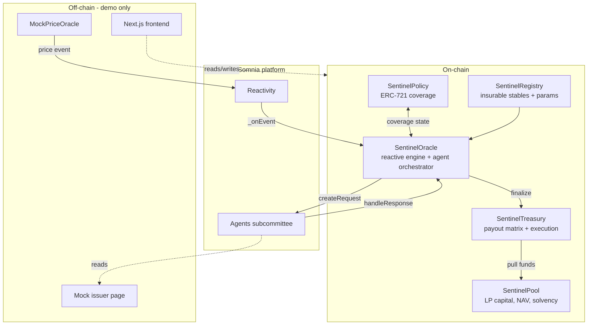
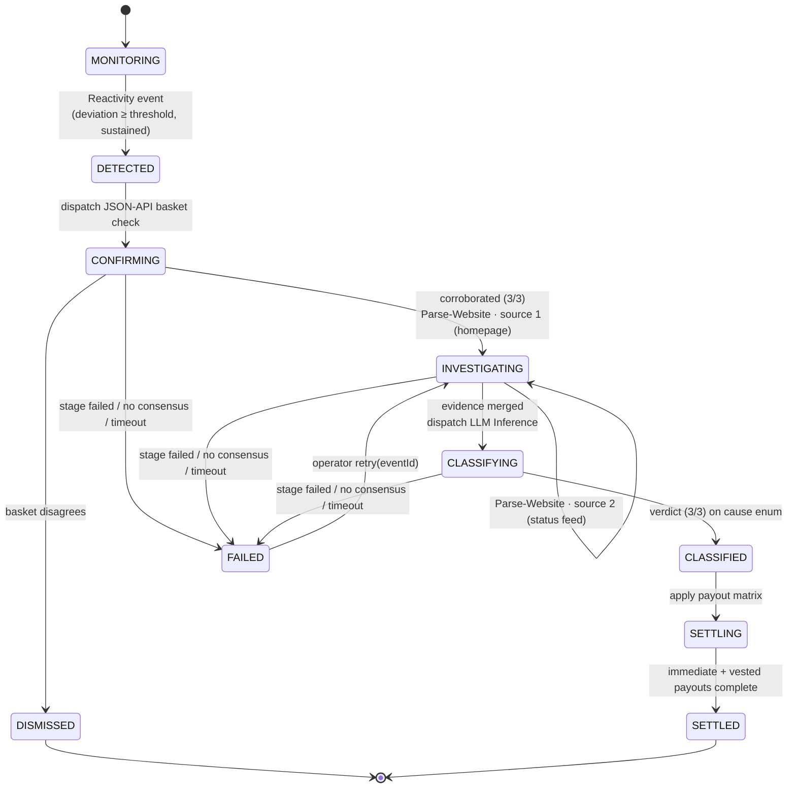
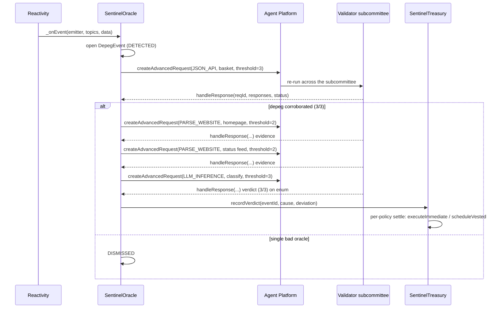

# Architecture

This document describes how Sentinel is designed and why. It is the technical companion to the project manual in [`CLAUDE.md`](../CLAUDE.md). Where this document and the live Somnia docs disagree on platform specifics, the live docs are authoritative.

---

## 1. System overview

Sentinel is a set of Solidity contracts plus a Next.js frontend. The contracts implement an autonomous pipeline that turns a price deviation into a justified, consensus-backed insurance payout. The frontend lets policyholders buy coverage, LPs provide capital, and anyone audit a payout decision.



The only off-chain components are demo conveniences: a mock price oracle (so a depeg can be triggered deterministically on stage), a mock issuer page (the target the investigation agent reads), and the frontend. There is no off-chain backend in the trust path.

## 2. The event state machine

Each detected depeg is a first-class on-chain object that advances through a strict state machine. State only advances on a valid, consensus-reached agent response bound to the correct request and stage.



The two `INVESTIGATING` sub-steps are the **two-source investigation**: the event stays in `INVESTIGATING` across both Parse-Website calls (the issuer's formal disclosure, then its status feed) and only advances to `CLASSIFYING` once both disclosures are gathered and merged. Single-source stables (no distinct `socialUrl`) skip straight from the first source to `CLASSIFYING`.

Key properties:
- **Idempotent callbacks.** A late or duplicate agent response must not re-advance state or double-pay. Each `requestId` maps to exactly one (eventId, stage); the context entry is deleted on first handling, so replays/late/duplicate callbacks no-op.
- **Fail-safe defaults.** A `ResponseStatus` of failure/no-consensus/timeout does not pay out; it parks the event as `FAILED` (which frees the stable's live slot) for an operator `retry(eventId)` from exactly where it stalled. A stuck event is always preferable to an unjustified payout.
- **No human step** exists between `DETECTED` and `SETTLED` on the happy path.

## 3. Agent orchestration

Three agent calls run in sequence, each gated on the previous result. The orchestration lives in `SentinelOracle`.



The per-stage `threshold` is the **tiered consensus** rule (see §7): `3` for the payout-gating Confirm + Classify, `2` for the two Parse-Website investigate stages. The Oracle re-checks agreement on-chain in `_consensusResult(responses, required)` — it never trusts the platform's report or `responses[0]`.

**Determinism requirement — validated on testnet (2026-05-29).** For the LLM-Inference call to reach subcommittee consensus, every validator must produce the same output. The spike proved this works: calling `inferString(prompt, system, chainOfThought, allowedValues)` with `allowedValues` set to the fixed Classification token set and `chainOfThought = false` constrains the model to one token, and the subcommittee agreed (both validators returned `SMART_CONTRACT_EXPLOIT`). The classifier therefore passes the enum as `allowedValues` rather than relying on prose instructions. Fallback if a future model regresses: extract structured evidence and classify on-chain.

**Agent payload encoding.** The `payload` arg to `createRequest` is treated as **calldata**: a 4-byte agent-method selector followed by ABI-encoded args. Build it with `abi.encodeWithSelector(IAgent.method.selector, …)`, never a bare `abi.encode(...)` (which the agent rejects as `unknown function selector 0x00000000`). JSON-API selectors are bare dot-paths (`"price"`, no `$.`). Canonical interfaces: `src/interfaces/IAgentPlatform.sol`.

**Deposit budgeting.** Agent requests are funded above `getRequestDeposit() + pricePerAgent × subcommitteeSize`; under-funding sets perAgentBudget≈0 and validators silently ignore the request. The Oracle holds a native-token balance for this and implements `receive()` to capture the median-cost rebate. Measured costs: JSON API ≈ 0.03 STT/validator, LLM Inference ≈ 0.07 STT/validator, Parse-Website ≈ 0.10 STT/validator. Consensus is **tiered per stage** (see the decisions log): the payout-gating Confirm + Classify require strict 3/3 unanimity; the Parse-Website investigate stages require a 2-of-3 majority (that agent reliably musters only a quorum on testnet). The per-stage requirement is passed as the `createAdvancedRequest` threshold so the platform finalizes at the right count.

## 4. Contract responsibilities

| Contract | Responsibility | Key invariant |
|---|---|---|
| **SentinelRegistry** | Operator-managed list of insurable stablecoins and their params (peg target, threshold bps, min duration, premium rate, deviation tiers, issuer URLs) | Only registered + active stables can be insured or trigger events |
| **SentinelPool** | LP capital as ERC-4626-style shares; NAV; premium accrual; solvency / utilization cap; authorized payout pulls | Shares never mint value from nothing; can't withdraw capital reserved for a settling event; liability ≤ capital × cap |
| **SentinelPolicy** | ERC-721 coverage; policy lifecycle (quote→buy→active→claimable→claimed→expired) | Claimable only if active and past min-age at event-trigger time and stable matches |
| **SentinelOracle** | Reactive handler + agent orchestrator + event state machine | State advances only on valid consensus-reached responses; idempotent; no payout without finalized classification |
| **SentinelTreasury** | Payout matrix application; immediate and vested execution | Total paid per event ≤ reserved; CEI + reentrancy guard; vested claims can't over-claim |

Shared logic lives in `libraries/`: `PayoutMath` (factor from classification + deviation + tier), `Classification` (enum + strict parsing of agent output), `FixedPoint` (one money convention).

## 5. Data model (core structs)

Indicative shapes; finalize during implementation.

```solidity
struct StableConfig {
    uint256 pegTarget;          // fixed-point, e.g. 1e18 for $1.00
    uint16  depegThresholdBps;  // deviation that arms detection
    uint32  minDurationSeconds; // sustained-deviation requirement
    uint16  annualRateBps;      // premium pricing
    uint16[] deviationTierBps;  // tier boundaries for payout scaling
    string  homepageUrl;
    string  socialUrl;
    string  repoUrl;
    bool    active;
}

struct Policy {
    address holder;
    address stable;
    uint256 notional;
    uint256 premiumPaid;
    uint64  start;
    uint64  term;
    uint64  minAge;
    PolicyStatus status;
}

struct DepegEvent {
    address stable;
    uint256 observedPrice;
    uint64  triggeredAt;
    EventState state;
    Classification cause;       // set at CLASSIFIED
    uint16  deviationBps;
}

struct AgentContext {
    uint256 eventId;
    AgentStage stage;           // CONFIRM | INVESTIGATE | CLASSIFY
}
```

## 6. Why Somnia (technical rationale)

- **Reactivity** removes the off-chain keeper. On other chains, "detect a depeg and act" means a bot polling an RPC and racing to land a transaction — the exact failure mode that breaks automated DeFi at the worst moment. Somnia validators invoke the handler directly when the subscribed condition matches.
- **Agents** make the investigation trustless. An AI call from a normal contract is an oracle to a centralized model — you trust whoever runs it. Somnia re-runs the model across a validator subcommittee and gates the result on consensus, so the *reason* for a payout inherits the chain's trust guarantees.
- **Performance** makes same-block settlement real. Sub-second finality and sub-cent fees mean the immediate-tier payout can land before the depeg news finishes spreading, and the many small agent/payout transactions are economical.

## 7. Design decisions log

- **TIERED consensus via `createAdvancedRequest`: 3/3 on the payout-gating stages, 2-of-3 on the Parse-Website evidence stages (2026-05-31).** First pass made every stage strict 3/3-byte-identical unanimity. Live testing exposed the flaw: the **Parse-Website agent** (the headless-browser+LLM scraper used by both investigate stages) intermittently musters only **2 of 3 validators** on testnet — and on-chain receipts confirmed the responding two returned *byte-identical, correct* text while the 3rd simply never showed within the timeout. So strict 3/3 there failed ~half the time on a quorum that agreed. The JSON-API `Confirm` (a numeric price) and the LLM-Inference `Classify` (one token constrained by `allowedValues`) are deterministic and hit 3/3 reliably; the Phase-C gating spike that proved 3/3 had used the JSON-API agent, not Parse-Website. Resolution: **`_requiredFor(stage)`** returns `SUBCOMMITTEE_SIZE` (3) for `Confirm` + `Classify` and `MAJORITY` (2) for `Investigate`/`Investigate2`; it's passed as the `createAdvancedRequest` threshold (platform finalizes at that count, so majority stages don't stall on an absent 3rd) and re-checked in `_consensusResult(responses, required)`, which returns the largest byte-identical `Success` group only if its size `>= required`. The thesis is intact and arguably sharper: **the verdict that signs the payout requires unanimous 3/3; corroborating web evidence requires a majority that still agrees byte-for-byte.** `timeout = 0` reverts; use 300 s. Audit stamp shows `agreedCount/3 CONSENSUS` per stage. Locked by `test_confirm_majority_2of3_fails`, `test_confirm_partial_2_responders_fails`, `test_investigate_advances_on_2of3_majority`, `test_investigate_advances_on_2_responders`, `test_investigate_fails_when_no_two_agree`, `test_classify_majority_2of3_fails`.
- **Investigation reads two independent web sources sequentially (2026-05-31).** A single issuer page is one point of failure/manipulation. The Oracle now runs `Confirm → Investigate (homepage) → Investigate2 (social/status feed) → Classify`: `_onInvestigate` stores disclosure #1 and, if the stable's `socialUrl` is set and distinct from `homepageUrl`, dispatches a second Parse-Website call (`Stage.Investigate2`); `_onInvestigate2` stores disclosure #2; `_dispatchClassify` merges both into the classifier prompt (`"<#1> || Secondary source: <#2>"`). Both sources must be **rendered HTML** (the M6 Parse-Website lesson) — `/issuer/incident` (formal disclosure) and `/issuer/social` (status feed). `retry()` and the on-chain `Receipt[]` cover the new stage. Single-source stables (no distinct `socialUrl`) skip straight to Classify, so it's opt-in per stable. Locked by `test_two_source_investigate`.
- **Audit route is `/audit/[eventId]`, not `[requestId]` (deviation from CLAUDE.md §12).** §12 names the centerpiece `/audit/[requestId]`, but an event spans up to four agent requests (confirm + two investigates + classify). Keying the route on `eventId` lets one page stitch all of them into a single timeline via `getReceipts(eventId)`, grouping the returned `Receipt[]` by `(stage, requestId)`. A per-request route would fragment the proof across four URLs. Intentional, documented deviation.
- **Multiple insured stables share one pool; the frontend selects per-stable (2026-05-31).** The Registry always supported many stables; the deploy registers four (USDC + USDT + DAI + FRAX) and the frontend reads the deploy-synced `STABLES` list with a localStorage-backed selected-stable context (`lib/stables.tsx`). The dashboard + coverage screens scope to the selected stable; the LP pool is shared capital, so it stays global but locks withdrawals if **any** stable has a live event. `/audit` is event-scoped (reads the event's own `stable`) so it needs no selector.
- **Operator scenario switch demos every payout class (2026-06-01).** The issuer pages render five scenarios via `?incident=<cause>`; the classifier returns the matching cause. Rather than hard-wiring asset→cause, the dashboard has an operator **DEMO CAUSE** control that calls `registry.updateConfig` to re-point the selected stable's issuer URLs before a Simulate — so any asset can demo exploit / bank-run / regulatory / glitch and exercise the full payout matrix live. Per-asset defaults (USDC=exploit, USDT=bank-run, DAI=regulatory, FRAX=glitch) give variety out of the box. No contract change — `updateConfig` already existed; this added DAI/FRAX + the four assets are operator calls on the live registry (no core redeploy).
- **Autonomous, keeperless, multi-asset price monitoring — `PriceFeedPoller` (2026-06-01).** To make *"Sentinel detects depegs"* literal (not only operator-simulated), a standalone `PriceFeedPoller` owns a **self-rescheduling Reactivity cron**: each tick (`scheduleSubscriptionAtTimestamp`, re-armed from within `_onEvent`) dispatches a JSON-API agent (`fetchUint`) **per configured feed** to read the **real** USDC/USDT/DAI/FRAX prices from CoinGecko and writes each on-chain to a dedicated `…·live` asset — no off-chain keeper anywhere in the loop. **One poller covers all four** (the 32-STT subscription-owner minimum is paid once, not per asset — N separate pollers would lock N×32 STT; only the per-tick agent fees scale with feed count). Each live asset's investigation reads **two real independent sources** (issuer status + transparency/data — e.g. status.circle.com + circle.com/usdc; forum.makerdao.com + makerburn.com), matching the two-source design. Demo stables (mock feed, operator-simulated) and live assets (real feed, autonomous) are necessarily distinct: a real confirm feed reading ~$1.00 would (correctly) DISMISS a simulated depeg, so you can't merge them. The SentinelOracle's existing detection watches that write, so a genuine depeg autonomously fires the full pipeline and pays USDC·live's policyholder. Integration constraints solved: (1) `MockPriceOracle.setPrice` is owner-only, so the poller **owns** it and the operator's Simulate routes through `poller.operatorSetPrice` (reversible via `returnPriceOracleOwnership`); (2) the poller writes **only** the monitored asset, so the autonomous feed never fights a manual simulation on the four demo stables; (3) like any subscription owner the poller holds ≥32 STT, and `_onEvent` + dispatch are funding-safe (a failed re-schedule disarms cleanly instead of bricking the cron). Proven live: within minutes of arming it had polled 4× and observed `$0.999624` on-chain. The dashboard's LIVE MONITOR widget renders `poller.lastObservedPrice/At/pollCount`.
- **Source verification goes through forge → Blockscout, not hardhat-verify (2026-05-31).** Contracts are real the instant they're deployed (provable via `eth_getCode` + a view call), but Shannon Explorer renders an *unverified* address as a bare, EOA-looking page — and its indexer additionally mislabels some contracts as `is_contract: false` (with `creation_transaction_hash: null`) until it backfills the creation trace a few minutes post-deploy. That backfill gates verification: Blockscout refuses to verify anything it hasn't flagged as a contract. hardhat-verify v2 is unusable here (it routes through the Etherscan-V2 multichain endpoint, which doesn't know chain 50312, and reports "not a smart contract"); `forge verify-contract --verifier blockscout --verifier-url …/api/` works because `foundry.toml` matches the Hardhat build settings (0.8.30 / cancun / optimizer-200) so the bytecode matches. `pnpm verify:testnet` (`script/verify.ts`) drives forge over the artifact's `verify` array. **Lesson:** after a fresh deploy, wait for `is_contract: true` in `/api/v2/addresses/<a>` before verifying; "not a smart contract" right after deploy is indexer lag, not a deploy failure.
- **Audit receipts are persisted on-chain, not reconstructed from events (Phase 3, 2026-05-31).** The `/audit` centerpiece renders every validator's vote per stage. The Oracle already *emitted* `AgentReceiptRecorded`, but reading that back is hostile on Somnia: `eth_getLogs` caps at a 1000-block range and blocks come ~10/s, so any event older than ~100s falls outside a single query — and §25 forbids an off-chain indexer. Decision: `SentinelOracle` now also **stores** a `Receipt[]` per event (`stage, requestId, agentId, validator, status, result, executionCost, receiptId, timestamp`) in the same `handleResponse` loop, exposed via `getReceipts(eventId)` / `receiptCount(eventId)`. The audit screen is then a single contract read — refresh-proof, works for any historical event, and makes the receipt a literal first-class on-chain artifact (judge bias, CLAUDE.md §23) rather than a log line. Cost is bytes of IceDB storage per response (trivial at sub-cent fees); failed/timed-out stage votes are stored too, so the trail shows *why* a stage failed. Rejected: client-side `getLogs` with a live `watchContractEvent` capture (fragile on refresh / for past events) and a subgraph (forbidden off-chain backend). Locked by `test_getReceipts_records_every_validator_vote_across_stages`.
- **Parse-Website (Agent #2) target MUST be an HTML page, not a JSON endpoint (M6, 2026-05-31).** The first live `simulate-depeg` ran detection + JSON-API confirm cleanly, then parked in `Failed` at the investigate stage — both validators returned `ResponseStatus.Failed` with an empty result. Root cause: `ISSUER_PAGE_URL` was unset in `.env`, so `deploy.ts` fell back to registering the JSON feed URL (`/api/peg-status`) as the stable's `homepageUrl`. `IParseWebsiteAgent.ExtractString` is a headless-browser/LLM **web scraper**; pointed at a raw `application/json` response it cannot extract and fails. Fix: register the dedicated HTML incident page (`frontend/src/app/issuer/incident`, served at `/issuer/incident`) as `homepageUrl` (set `ISSUER_PAGE_URL`). After repointing, Parse-Website reached 2/2 consensus in ~13 s. **Lesson:** the JSON-API and Parse-Website agents need *different* targets (JSON feed vs. rendered HTML) even when the same site hosts both; never default one to the other. `script/recover-event.ts` automates the repoint + `retry` recovery.
- **A `Failed` event must free the stable's live slot (M6, 2026-05-31).** `_onEvent` dedupes on `liveEventOf[stable] != 0`; the original `Failed` paths set the state but never released the slot, so a single failure **permanently bricked detection** for that stable — a later `setPrice` silently no-op'd on the dedupe guard (this masked the Parse-Website failure above as a "fast 6.8 s failure" that was really stale-state polling). Fix: every `Failed` path now routes through `_fail()`, which frees the slot and clears the breach timer; `retry()` re-acquires the slot and reverts with `StableHasLiveEvent` if a newer event already claimed it (preserving one-live-event-per-stable). Regression-tested (`test_failed_event_frees_slot_for_new_detection`, `test_retry_reverts_when_stable_has_newer_live_event`). **Lesson:** any terminal-but-retriable state that holds a uniqueness lock must release it, or recovery is impossible without a redeploy.
- **EVM target pinned to `cancun` in both toolchains (M6).** `SentinelOracle` uses `Strings.toString` (to build the classifier prompt), which transitively pulls in OpenZeppelin 5.x's `Bytes.sol`; that library emits the `mcopy` opcode, introduced in Cancun. Foundry defaults to Cancun, so `forge build`/all tests compiled cleanly through M5 — but Hardhat defaults to `paris` and **failed to compile** the moment `deploy.ts` first invoked it in M6 (`TypeError: "mcopy" ... only available for Cancun-compatible VMs`). Fixed by setting `evm_version = "cancun"` in `foundry.toml` and `evmVersion: "cancun"` in `hardhat.config.ts` so both toolchains agree. Somnia is full-EVM and runs Cancun bytecode; this is a build-target alignment, not a contract change. **Lesson for future sessions:** a green `forge` suite does not imply Hardhat will compile — the two default to different EVM versions; run `npx hardhat compile` as its own gate before any deploy.
- **`getEvent` view is read via `getFunction("getEvent").staticCall` in scripts (M6).** ethers v6 `BaseContract` defines a built-in `getEvent(name)` event-accessor that **shadows** the Solidity `getEvent(uint256)` view of the same name. Calling `oracle.getEvent(eventId)` directly resolves to the ethers helper, returning an event fragment instead of querying the chain — a *silent* failure (no revert) that would have stranded `simulate-depeg.ts` mid-pipeline on the live run. `tsc` caught it (typechain types the real signature, so a `bigint` arg was a type error). The script routes these calls through `getFunction("getEvent").staticCall(eventId)`. **Lesson:** avoid Solidity view names that collide with ethers `BaseContract` members (`getEvent`, `getFunction`, `queryFilter`, `on`, `filters`, …); when unavoidable, call them via `getFunction(...)`. Run `tsc --noEmit` as a script gate.
- **Oracle dispatch is funding-safe; failures park, never revert the callback (M5).** `_onEvent` and every agent dispatch turn all failure modes (not insurable, under threshold, unfunded, missing confirm feed, `platform.createRequest` revert) into early returns + events — they never revert. A revert inside the Reactivity callback would brick the subscription. Stage agent failures (`Failed`/`TimedOut`/no-consensus) move the event to a `Failed` state the operator can `retry(eventId)` from exactly where it stalled. Auto-retry loops were rejected (could silently drain the deposit budget).
- **Oracle consensus computed on-chain, never trusting `responses[0]` (M5).** When the platform reports overall `Success`, the Oracle independently recomputes agreement: it takes the largest set of Success responses that share identical result bytes and advances only if that set meets the stage's required count; a 1-1-1 split or sub-threshold agreement parks the event as `Failed` rather than advancing on a plurality or reverting on a decode. Rejected: trusting `responses[0]` (could be the dissenter). *(The required count was uniform 2-of-3 at M5; it became **tiered** on 2026-05-31 — see the tiered-consensus entry above. The "never advance on a minority / never trust responses[0]" property is unchanged.)*
- **Oracle uses `Ownable`, not the project-standard `AccessControl` (M5).** It's the one contract on `Ownable`, because `SomniaEventHandler.supportsInterface` is a non-virtual `external pure override` that collides with `AccessControl.supportsInterface` under multiple inheritance. The Oracle's only human role is the operator, so one owner suffices; the two machine callers are gated structurally (the precompile via the base `onEvent`, the platform via `handleResponse`).
- **Confirm stage uses `fetchUint` (WAD), not `fetchString` (M5).** The basket price arrives as a `uint256` at 18 decimals, directly comparable to the registry peg target — no fragile on-chain string→number parsing in the value path (Hard Rule #10). Operator sets the feed decimals via `setConfirmFeed`.
- **Parametric, not assessed.** Payouts are a formula on observable parameters (deviation, classification, notional). This is what enables instant autonomous settlement; it also sidesteps the discretion that makes traditional claims slow.
- **Classification gates payout *shape*, not just yes/no.** Different causes get different factors and timing (exploit → immediate/full; bank-run → vested) so the product is economically sound and farm-resistant, and so the demo has a visible "the AI's verdict changed the outcome" beat.
- **Confirmation before investigation.** The cheap JSON-API basket check runs first to reject single-oracle false positives before spending on the more expensive LLM agents.
- **Vesting + min-age over complex fraud checks.** Simple, auditable anti-farming primitives chosen over elaborate mechanisms that would burn the 3-week budget.
- **Mock oracle + mock issuer for the demo.** Determinism on stage beats realism; a controllable trigger is worth more than a live feed for a 3-minute video.
- **ERC-4626-style pool, ERC-721 policies.** Standard, legible primitives that reviewers recognize instantly.
- **`PayoutMath` factor model (M1).** `factor = classCap × tierScale`. Two classes are deliberately *not* scaled by deviation: `SMART_CONTRACT_EXPLOIT` always pays its full 100% cap once over the no-payout floor (an exploit is an exploit regardless of the transient price print), and `REGULATORY` is a flat 50% (legal actions aren't well-modeled by price magnitude). `BANK_RUN` / `TECHNICAL_GLITCH` / `UNKNOWN` scale across the configured tiers. The no-payout floor applies to *every* class — a sub-threshold blip never pays. **⚠ Revisit candidate** — see Known limitations §8.
- **`Treasury.settle` per-policy, not `routePayouts` over all policies (M4).** The spec describes `routePayouts(eventId)` looping every affected policy. On-chain that's an unbounded gas loop. Instead the Oracle records a finalized verdict (`recordVerdict`) and each policy is settled individually (`settle(eventId, tokenId)`) — gas-bounded, one per tx, permissionlessly pokeable. Capital is `reserveForEvent`-d the instant a policy settles, before any disbursement, so `paid ≤ reserved` holds per policy and in aggregate. Exploit class pays immediately; the rest write a `Vesting{amount, releaseAt}` claimed later via `claimVested`. Double-settle is blocked by the Policy state machine (`markClaimable` reverts once a policy leaves Active), and `claimVested` has its own `claimed` flag + `nonReentrant` (regression-tested against a re-entrant capital token).

## 8. Known limitations

- Unaudited prototype; testnet only.
- ~~LLM-Inference determinism under consensus is the principal technical risk~~ — **validated on testnet 2026-05-29** (see §3 and `docs/spike-results.md`); the `allowedValues` constraint yields subcommittee consensus.
- ~~The full three-agent chain within a single block is not yet proven on live testnet~~ — **proven end-to-end on testnet 2026-05-31 (M6).** `simulate-depeg` ran Reactivity → JSON-API confirm → Parse-Website investigate → LLM-Inference classify → payout autonomously in ~27 s, each stage reaching validator consensus. It resolves across **sequential blocks** (one callback advances one stage), not a single block — which is fine; the Oracle is designed for exactly that and stays autonomous throughout.
- ~~LLM Parse Website signature is UNVERIFIED~~ — **verified 2026-05-30** against two independent `docs.somnia.network/agents/base-agents/llm-parse-website` fetches. It is `IParseWebsiteAgent.ExtractString` (capital E — selector-significant) with **8 params** (`key, description, options, prompt, url, resolveUrl, numPages, confidenceThreshold`), NOT the earlier guessed `parseString(url, instruction)`. Encoded in `_buildInvestigatePayload`; the 8 args come from operator-settable `investigateParams` (`setInvestigateParams`) with an always-empty `options` array (unconstrained free-form disclosure). A regression test (`test_investigate_payload_uses_ExtractString_selector`) locks the selector. The free-form output still passes through the strict 2-of-3 consensus gate — deterministic for the fixed mock-issuer page; a live/changing page could strand investigate in `Failed`, with the JSON-API `disclosure` fetch as the documented escape hatch (operator `retry` after a swap). **Proven on testnet 2026-05-31 (M6): Parse-Website reached 2/2 validator consensus against the HTML incident page in ~13 s, and the downstream classifier returned `SMART_CONTRACT_EXPLOIT`.** ⚠ **Target must be an HTML page, not a JSON endpoint** — see the M6 decisions-log entry; pointing `ExtractString` at the JSON `/api/peg-status` feed returns `Failed`/empty from every validator (it's a web scraper, not a JSON reader).
- ~~The Reactivity subscribe→`_onEvent` round-trip is not yet exercised~~ — **proven on testnet 2026-05-29 (M0)**; see `docs/spike-results.md`. The live `SentinelOracle` must hold ≥32 STT to own its subscription.
- **⚠ Revisit (`PayoutMath`): `EXPLOIT` and `REGULATORY` ignore the deviation tier.** Exploit pays a flat 100% and regulatory a flat 50% once over the no-payout floor, while the other three classes scale with deviation magnitude. This is defensible (cause severity, not price size, drives those two) but it's an asymmetry a reviewer may challenge and it's the most likely matrix tweak post-spike. If we later want exploit/regulatory to also scale (e.g. a tiny exploit that barely moved the peg paying less than 100%), it's a localized change in `PayoutMath.payoutFactorBps` — no other contract depends on the internal shape, only on the returned bps. Flagged for a deliberate decision before mainnet.
- **Utilization cap is admission-control, not a perpetual invariant (M2 finding).** `SentinelPool` enforces `outstandingLiability ≤ totalAssets × cap` only at policy-sale time (`increaseLiability` reverts on breach). After a payout or LP redemption shrinks `totalAssets`, the *ratio* can legitimately exceed the cap — the pool simply can't originate new coverage until capital recovers. This is standard insurance-pool behavior (you can be underwater on a ratio after a loss); the load-bearing on-chain guarantee is instead the accounting identity `availableCapital + reservedCapital == totalAssets`, which the invariant suite proves holds after any operation sequence (128k calls). Surfaced when an early invariant wrongly asserted the continuous ratio; see `test/SentinelPool.invariant.t.sol`.
- Single insured stablecoin in the MVP; multi-stable and real risk pricing are post-hackathon.
- Reactivity mainnet availability unconfirmed; testnet (min stake 32 STT) is sufficient for the hackathon.
- Performance figures (1M TPS) are Somnia-published benchmarks; sub-second finality and sub-cent fees are the load-bearing properties and are independently observable.
