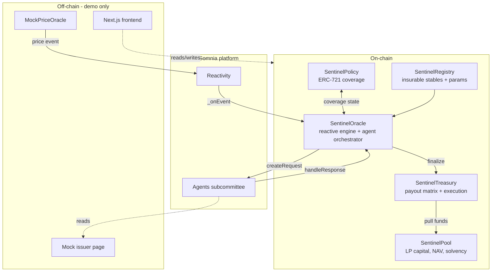
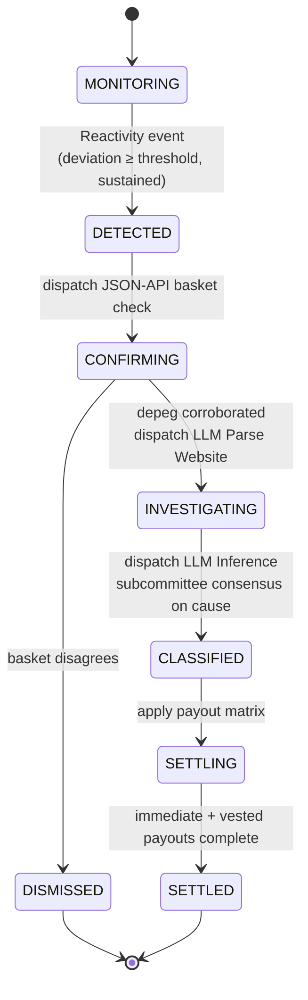
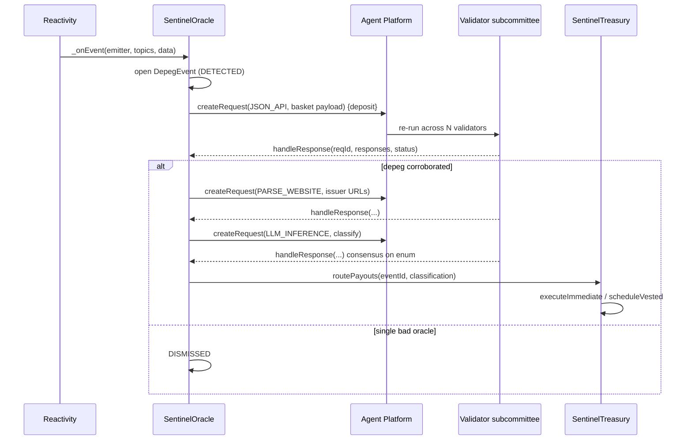

# Architecture

This document describes how Sentinel is designed and why. It is the technical companion to the project manual in [`CLAUDE.md`](../CLAUDE.md). Where this document and the live Somnia docs disagree on platform specifics, the live docs are authoritative.

---

## 1. System overview

Sentinel is a set of Solidity contracts plus a Next.js frontend. The contracts implement an autonomous pipeline that turns a price deviation into a justified, consensus-backed insurance payout. The frontend lets policyholders buy coverage, LPs provide capital, and anyone audit a payout decision.



The only off-chain components are demo conveniences: a mock price oracle (so a depeg can be triggered deterministically on stage), a mock issuer page (the target the investigation agent reads), and the frontend. There is no off-chain backend in the trust path.

## 2. The event state machine

Each detected depeg is a first-class on-chain object that advances through a strict state machine. State only advances on a valid, consensus-reached agent response bound to the correct request and stage.



Key properties:
- **Idempotent callbacks.** A late or duplicate agent response must not re-advance state or double-pay. Each `requestId` maps to exactly one (eventId, stage); responses for already-advanced stages are ignored.
- **Fail-safe defaults.** A `ResponseStatus` of failure/no-consensus/timeout does not pay out; it parks the event and (optionally) retries or dismisses with a logged reason. Stranding in `INVESTIGATING` is preferable to an unjustified payout.
- **No human step** exists between `DETECTED` and `SETTLED`.

## 3. Agent orchestration

Three agent calls run in sequence, each gated on the previous result. The orchestration lives in `SentinelOracle`.



**Determinism requirement.** For the LLM-Inference call to reach subcommittee consensus, every validator must produce the same output. Prompts therefore demand a single token or strict minimal JSON (just the enum value). This constraint is documented at each agent call site. If determinism proves unreliable, the fallback is to have agents extract structured evidence and perform the classification logic on-chain.

**Deposit budgeting.** Agent requests are funded above the scheduled execution cost; under-funding causes validators to ignore the request. The Oracle holds a native-token balance for this and implements `receive()` to capture rebates of unused deposit.

## 4. Contract responsibilities

| Contract | Responsibility | Key invariant |
|---|---|---|
| **SentinelRegistry** | Operator-managed list of insurable stablecoins and their params (peg target, threshold bps, min duration, premium rate, deviation tiers, issuer URLs) | Only registered + active stables can be insured or trigger events |
| **SentinelPool** | LP capital as ERC-4626-style shares; NAV; premium accrual; solvency / utilization cap; authorized payout pulls | Shares never mint value from nothing; can't withdraw capital reserved for a settling event; liability ≤ capital × cap |
| **SentinelPolicy** | ERC-721 coverage; policy lifecycle (quote→buy→active→claimable→claimed→expired) | Claimable only if active and past min-age at event-trigger time and stable matches |
| **SentinelOracle** | Reactive handler + agent orchestrator + event state machine | State advances only on valid consensus-reached responses; idempotent; no payout without finalized classification |
| **SentinelTreasury** | Payout matrix application; immediate and vested execution | Total paid per event ≤ reserved; CEI + reentrancy guard; vested claims can't over-claim |

Shared logic lives in `libraries/`: `PayoutMath` (factor from classification + deviation + tier), `Classification` (enum + strict parsing of agent output), `FixedPoint` (one money convention).

## 5. Data model (core structs)

Indicative shapes; finalize during implementation.

```solidity
struct StableConfig {
    uint256 pegTarget;          // fixed-point, e.g. 1e18 for $1.00
    uint16  depegThresholdBps;  // deviation that arms detection
    uint32  minDurationSeconds; // sustained-deviation requirement
    uint16  annualRateBps;      // premium pricing
    uint16[] deviationTierBps;  // tier boundaries for payout scaling
    string  homepageUrl;
    string  socialUrl;
    string  repoUrl;
    bool    active;
}

struct Policy {
    address holder;
    address stable;
    uint256 notional;
    uint256 premiumPaid;
    uint64  start;
    uint64  term;
    uint64  minAge;
    PolicyStatus status;
}

struct DepegEvent {
    address stable;
    uint256 observedPrice;
    uint64  triggeredAt;
    EventState state;
    Classification cause;       // set at CLASSIFIED
    uint16  deviationBps;
}

struct AgentContext {
    uint256 eventId;
    AgentStage stage;           // CONFIRM | INVESTIGATE | CLASSIFY
}
```

## 6. Why Somnia (technical rationale)

- **Reactivity** removes the off-chain keeper. On other chains, "detect a depeg and act" means a bot polling an RPC and racing to land a transaction — the exact failure mode that breaks automated DeFi at the worst moment. Somnia validators invoke the handler directly when the subscribed condition matches.
- **Agents** make the investigation trustless. An AI call from a normal contract is an oracle to a centralized model — you trust whoever runs it. Somnia re-runs the model across a validator subcommittee and gates the result on consensus, so the *reason* for a payout inherits the chain's trust guarantees.
- **Performance** makes same-block settlement real. Sub-second finality and sub-cent fees mean the immediate-tier payout can land before the depeg news finishes spreading, and the many small agent/payout transactions are economical.

## 7. Design decisions log

- **Parametric, not assessed.** Payouts are a formula on observable parameters (deviation, classification, notional). This is what enables instant autonomous settlement; it also sidesteps the discretion that makes traditional claims slow.
- **Classification gates payout *shape*, not just yes/no.** Different causes get different factors and timing (exploit → immediate/full; bank-run → vested) so the product is economically sound and farm-resistant, and so the demo has a visible "the AI's verdict changed the outcome" beat.
- **Confirmation before investigation.** The cheap JSON-API basket check runs first to reject single-oracle false positives before spending on the more expensive LLM agents.
- **Vesting + min-age over complex fraud checks.** Simple, auditable anti-farming primitives chosen over elaborate mechanisms that would burn the 3-week budget.
- **Mock oracle + mock issuer for the demo.** Determinism on stage beats realism; a controllable trigger is worth more than a live feed for a 3-minute video.
- **ERC-4626-style pool, ERC-721 policies.** Standard, legible primitives that reviewers recognize instantly.

## 8. Known limitations

- Unaudited prototype; testnet only.
- LLM-Inference determinism under consensus is the principal technical risk (see §3); mitigations are designed in but must be validated empirically.
- Single insured stablecoin in the MVP; multi-stable and real risk pricing are post-hackathon.
- Reactivity may be testnet-only at build time; confirm mainnet availability before any production claim.
- Performance figures (1M TPS) are Somnia-published benchmarks; sub-second finality and sub-cent fees are the load-bearing properties and are independently observable.
